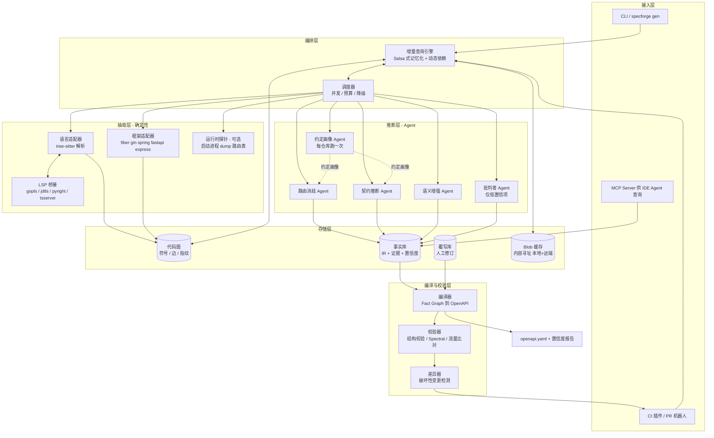
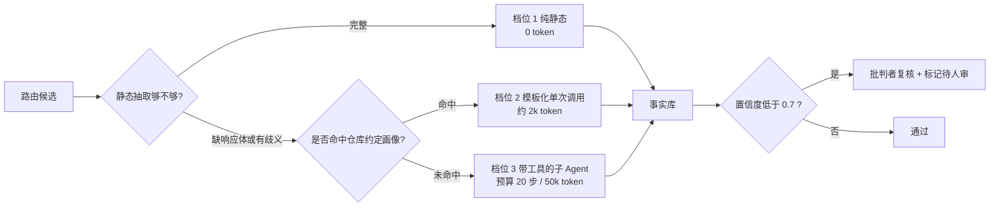
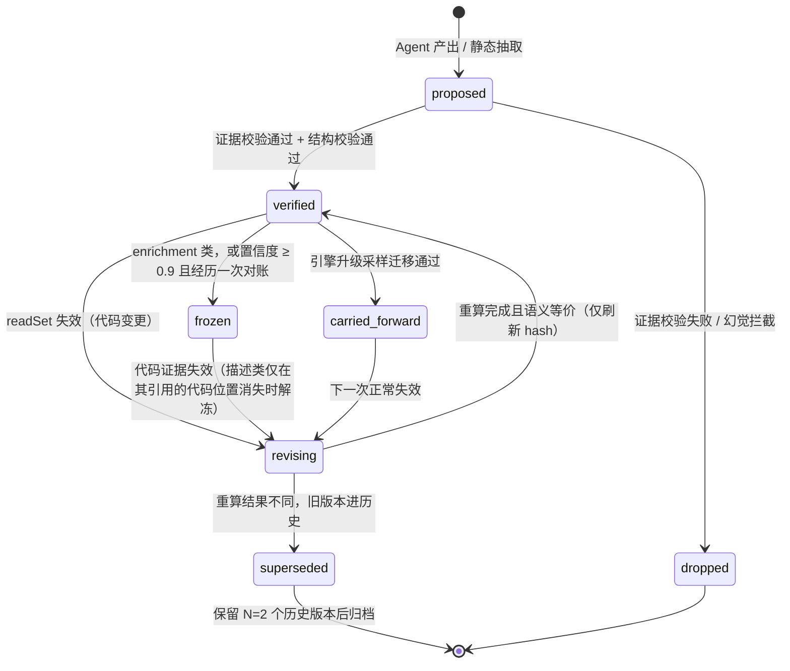
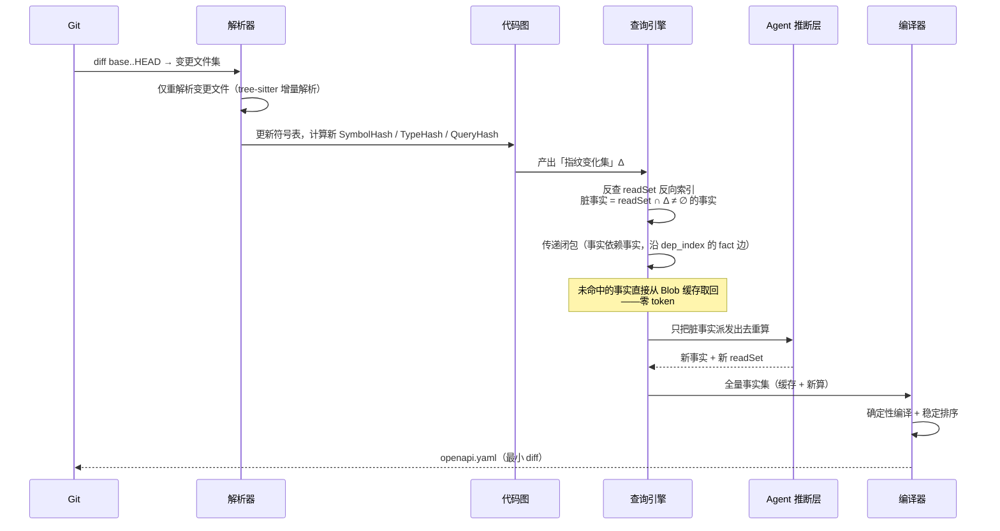
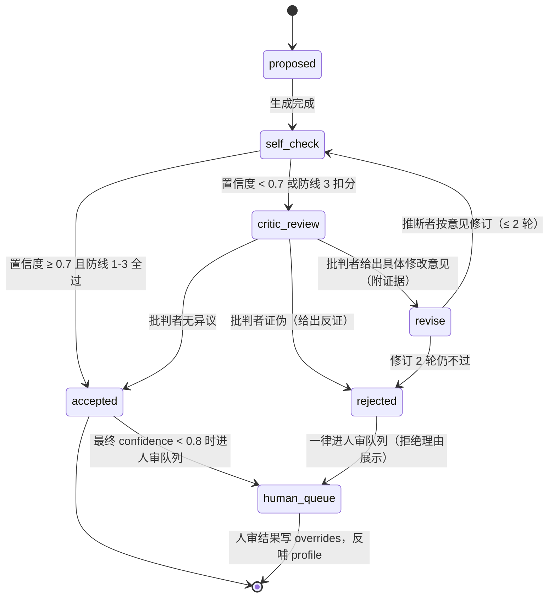
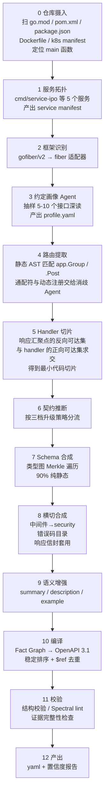
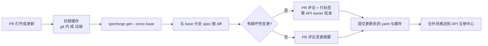

# SpecForge v2.0 设计文档 — Agent 原生的 OpenAPI 生成系统

> **定位**：不依赖注解/注释，从任意代码仓库的任意服务中提取真实 HTTP 契约，产出 OpenAPI 3.1；并以「构建系统」的方式做增量分析，使改一行代码只重算受影响的那几个事实。
>
> **v2.0 说明**：本版在 v1 设计（思想、架构、路线图）基础上，将四块技术核心推进到接口级细节——增量查询引擎、Agent 编排协议、IR 与编译器、类型系统边界；并新增 P0 原型验证方案、成本模型量化、团队与运营、竞品深度对比四章。全文面向实现者，可直接作为开发任务的拆解依据。

| 项 | 内容 |
|---|---|
| 文档版本 | v2.0 |
| 文档状态 | 待评审（工程实现级） |
| 目标读者 | SpecForge 开发团队、平台工程团队、API 平台负责人 |
| 上一版本 | v1.0（架构设计稿） |
| 评审方式 | 分章评审：第 4–8 章需内核/适配器负责人逐条确认 |

## 0. v2 导读与变更总览

v1 回答的是「SpecForge 应该长什么样」；v2 回答的是「它具体怎么实现、怎么验证、多少钱、谁来做」。两版之间不是推翻，而是把 v1 中四处「点到为止」的关键设计推到可以直接排开发任务的程度。老读者可以按下表定位增量内容，新读者按顺序通读即可。

| 领域 | v1 状态 | v2 变更 | 所在章节 |
|---|---|---|---|
| 数据模型 | 概念性 Fact 接口 | 完整 TypeScript 类型全集、Fact 生命周期状态机、多键身份解析算法、SQLite DDL、Blob 格式 | 第四章 + 附录 A/B |
| 增量引擎 | Salsa 思想描述 | Query trait 与执行上下文、失效传播算法伪代码、readSet 反向索引、并发调度、对账协议、依赖完备性分类表 | 第五章 |
| Agent 层 | 五个 Agent 列举 | 工具 JSON Schema 协议、依赖记录包装器、四道输出校验防线、批判者状态机、预算降级链、提示词版本化 | 第六章 |
| 类型系统 | 提到难点 | 四语言映射总表 + 14 个疑难 case 的处理策略与降级路径、shapeHash 边界规则 | 第七章 |
| 编译器 | 六条确定性规则 | 八阶段流水线、事实合并优先级、$ref 命名伪代码、覆写 merge 语义、多目标编译 | 第八章 |
| 验证 | 路线图一行 | P0 三周天级计划、ground truth 构建方法、go/no-go 判据 checklist、失败回退决策树 | 第十二章 |
| 成本 | 定性判断 | 首次全量/稳态增量成本公式、三规模仿真、预算降级链、敏感度分析 | 第十三章 |
| 组织 | 无 | 角色矩阵、人周排期、开源策略、推广路径、运营指标 | 第十四章 |
| 竞争 | 差异表一行 | 七类竞品技术路线逐一对比与定位 | 第十五章 |

v1 中被证明仍然成立、本版原样保留的内容（需求梳理、四个核心思想、总体架构图、三档升级策略、工作流程主干、路线图节奏）不再重复论证，只做文字收敛与细节补强。所有对本仓库（trade 仓库，Go + fiber，单仓多服务）的引用继续作为贯穿全文的落地样本。

---

## 一、需求梳理

### 1.1 现状与痛点

主流 OpenAPI 生成方式全部是**代码内嵌式**：Go 用 swaggo 注释或 kratos proto，Java 用 springdoc / swagger-annotations，Python 靠 FastAPI 类型注解（Flask/Django 需 drf-spectacular 配置），Node 用 NestJS decorators 或 tsoa。它们的共同前提是：**开发者愿意并持续地写这些元信息**。实际生产中三件事必然发生：其一，大量存量服务一行注解都没有，补注解的改动量等同于重写接口层；其二，写了注解的项目，注解与代码随时间漂移，文档比没有更危险；其三，注解只能描述 handler 函数签名看得见的东西，真实响应体往往在 service 层深处才被写出，注解表达不了。

本仓库就是典型样本。`internal/ipoServer/router.go` 里：

```go
ipoServers := app.Group("/ipo/v*")          // 通配符路径，不是合法 OpenAPI path
ipoServers.Post("/OrderCheck",
    auth.GetUserRelation(), ipoIntercepter, auth.PermissionCheck("0xff"),
    ipoController.OrderCheck)                // 三层中间件 = 三组隐式鉴权/请求头约束
```

而 handler 本身几乎不含契约信息：

```go
func (u *IpoController) OrderCheck(c *fiber.Ctx) error {
    r := new(mapping.OrderCheckReqParams)    // 请求体：要跳到 mapping 包才知道
    if err := c.BodyParser(r); err != nil {
        return code.WriteResponse(c, code.NewDefaultError(code.ErrInvalidBody), nil)
    }
    if err := r.Validate(); err != nil {      // 校验规则：在 Validate() 里
        return code.WriteResponse(c, err, nil)
    }
    return u.srv.OrderCheck(c, &r.Params)     // 响应体：在 service 层深处才写出
}
```

结论：**响应契约不在 handler 里，在调用图里。** 任何只看函数签名的方案都做不出这个仓库的文档。这不是本仓库的特殊性，而是「注解式工具」与「真实代码组织方式」之间的结构性错配——业务逻辑分层越深，错配越严重。

### 1.2 目标

**主目标**：给定 `(仓库, 服务名)`，产出一份准确、可读、可用于 mock/SDK/网关的 OpenAPI 3.1 YAML，全程零注解要求。**同等重要的目标**：让第 2 次及以后的运行**几乎免费**——改 3 个文件的 PR，应只触发个位数的模型调用、30 秒内完成、成本低于 ¥1。

### 1.3 功能需求

v1 的 F1–F12 需求编号继续沿用，本版为每条补充「验收口径」，使其在评审和测试时可逐条打勾，而不是停留在意图层面。验收口径的统一格式是：**给定输入 X，产出 Y，以 Z 方式验证**。

| 编号 | 需求 | 说明 | v2 验收口径 |
|---|---|---|---|
| F1 | 服务拓扑发现 | 单仓多服务时定位入口、路由注册点、编译边界 | 给定任意 monorepo，输出 service manifest 列表；与构建系统目标（Makefile/CI matrix）交叉核对一致 |
| F2 | 框架识别 | 依赖 + import 模式 → 选择适配器 | 识别结果必须携带证据（依赖声明 file:line）；无适配器时显式报「不支持」而非猜测 |
| F3 | 路由提取 | method / path 模板 / 路径参数 / 中间件链；处理循环注册、通配符、表驱动路由 | 路由召回 ≥ 98%；每条路由可溯源到注册语句；静态与运行时探针结果差集必须显式输出 |
| F4 | 请求契约推断 | path/query/header/cookie 参数、body schema、content-type、校验约束 | 参数四元组 (in, name, required, type) 匹配 F1 ≥ 95%；校验约束来自 validator tag 实际解析 |
| F5 | 响应契约推断 | 沿调用图找到所有响应写出点，还原状态码 × body schema 矩阵，含错误分支 | 响应字段 F1 ≥ 90%；状态码召回 ≥ 85%；每个响应分支携带 sink 位置的 file:line |
| F6 | Schema 合成 | 类型 → JSON Schema，含嵌套、泛型、枚举、可空、联合、omitempty | 第七章映射总表逐条有单测；疑难 case 按 7.2 清单逐个验收 |
| F7 | 横切关注点 | 中间件 → securitySchemes；统一响应信封；分页约定；版本前缀 | 约定画像输出结构化 profile.yaml；中间件到 securityScheme 的映射可被人工覆写 |
| F8 | 语义增强 | summary / description / example / tag | 生成内容不得引入结构性信息（字段/类型/状态码）；description 冻结策略生效 |
| F9 | 增量更新 | 基于 git diff 只重算受影响事实 | 回放真实 commit 历史，缓存命中率 ≥ 95%，P90 < 60s |
| F10 | 人工覆写留存 | 人改过的描述/示例在重新生成后不被冲掉 | 路径/方法/handler 重命名三类扰动下覆写存活率 ≥ 95% |
| F11 | 置信度与证据 | 每个字段可溯源到 file:line；低置信项单独列出待审 | 编译期强制丢弃无有效证据的事实；报告列出全部 < 0.8 项 |
| F12 | 破坏性变更检测 | 与基线 spec 对比，在 PR 上评论 | diff 规则表（见 9.3）覆盖必填化/删除字段/类型收窄等 12 类变更 |

### 1.4 非功能需求

- **确定性**：同样的代码 + 同样的引擎版本 → 逐字节相同的 YAML。文档不能因为模型抖动而产生噪声 diff。这是把文档放进 CI gate 的前提，也是团队信任的前提。
- **成本可控**：有 token 预算上限，超预算降级而非失败。降级路径必须在输出中显式声明，不允许静默降质。
- **可审计**：任何一个推断都能回答「你凭什么这么写」。审计粒度到字段级，证据到行级。
- **可插拔**：新增一门语言/框架 = 实现一个适配器接口，不动内核。以「适配器实现者不需要理解增量引擎」为验收标准。
- **CI 友好**：能在 PR 流水线里跑完。冷启动（无缓存）< 30 分钟（大仓），热路径 < 60 秒。

### 1.5 非目标（明确不做）

不做代码改写（不往用户代码里插注解）；不追求 100% 准确率——目标是「比手写文档更准、且永不过期」，剩余部分靠置信度标记交给人；不做 GraphQL / gRPC 一等公民支持（v1 只做 HTTP/JSON，gRPC 有 proto 作为真源，本来就不需要这套）。另外补充两条 v2 明确排除的：不做 API 设计校验（lint 规范类功能交给 Spectral 等成熟工具，SpecForge 只负责产出事实）；不做流量录制产品（运行时流量只作为校验信号源之一，不存储、不回放）。

### 1.6 验收标准

| 维度 | 指标 | 测量方法 |
|---|---|---|
| 路由召回率 | ≥ 98% | 评测基准（11.1）+ 运行时探针差集 |
| 请求字段 F1 | ≥ 95% | 评测基准，四元组匹配 |
| 响应字段 F1 | ≥ 90% | 评测基准，嵌套展平后匹配 |
| 状态码召回 | ≥ 85% | 评测基准 + 流量样本交叉 |
| 幻觉率 | < 1% | 无代码证据的字段数 / 总字段数 |
| 增量缓存命中率 | 典型 PR ≥ 95% | commit 历史回放（8.2 增量评测） |
| 增量耗时 | P90 < 60s | CI 环境实测 |
| 输出确定性 | 逐字节相同 | 同输入双跑 diff 为空（回归测试常驻） |

---
## 二、核心设计思想

四个判断决定了整个架构，其余都是推论。v2 对每个思想补充其「推论链」——即从思想到具体机制的必然推导，评审时可以逐环检验。

### 思想 1：这不是「让 LLM 读代码写 YAML」，这是一条编译流水线，LLM 只是其中一个 pass

把 LLM 当唯一手段，会同时踩中成本高、不确定、不可增量三个坑。正确分工是三层：

- **静态分析能算准的，绝不问模型**：类型结构、字段名、JSON tag、validator tag、路由字面量。这部分精确、免费、天然可缓存。
- **静态分析算不准的，才交给模型**：通配符路径展开、跨层响应追踪、`map[string]any` 的实际形状、中间件语义、错误码集合。
- **静态分析永远算不出的，只能给模型**：这个接口是干什么的、字段的业务含义、合理的示例值。

推论链：流水线化 → 必须有中间表示 → 模型输入输出都是结构化事实 → 校验与缓存都作用于事实粒度 → 文档质量的天花板由静态抽取的下限决定（而不是模型上限）。最后一条推论常被忽视：如果路由都抽不全，模型再强也补不回来，所以工程投入的优先级永远是「抽取层做深」优先于「提示词调优」。

### 思想 2：LLM 不产出 YAML，产出「API 事实」

让模型直接吐 YAML 有三个问题：输出不稳定、无法局部更新、无法校验。改成：模型产出**小颗粒、强类型、可组合的事实（Fact）**，落进中间表示（API Fact Graph）；再由**确定性编译器**把事实图编译成 OpenAPI。好处是连锁的：缓存粒度 = 事实粒度；输出排序、`$ref` 命名、schema 去重全部由编译器保证；同一份 IR 可以编译出 OpenAPI 3.0 / 3.1 / TypeSpec / MCP tool 定义 / SDK；IR 可以做 schema 校验和 lint，能挡住一部分幻觉。

推论链：事实必须强类型 → FactKind 枚举封闭 → 每类事实有独立的生命周期与校验规则 → 「新增一类事实」成为系统的扩展点而非改动点（第四章）。

### 思想 3：增量的正确解法是「带动态依赖的记忆化查询引擎」，不是「diff 文件」

朴素做法「文件变了就重算这个文件相关的一切」太粗：改一行日志会让整个文件的所有接口重算。正确做法是照搬 rust-analyzer 的 **Salsa** 模型 / Bazel 的动态依赖模型：每一次计算（包括每一次 LLM 调用）都是一个 **query**，执行时记录它实际读取了什么（read set）；某个 query 的结果失效，当且仅当 read set 里任何一项的指纹发生变化。

而 Agent 原生这件事在这里产生了一个漂亮的性质：**Agent 的工具调用轨迹，天然就是依赖记录。** Agent 为推断 `POST /OrderCheck` 的响应，调用了 `read_symbol`、`callees`、`read_type`……这些调用连同各自返回值的哈希，就是这条事实的精确 read set。下次这些东西哈希不变，直接复用缓存，一个 token 都不花。不需要猜「哪些改动会影响哪些接口」——运行时已经告诉你了。

推论链：工具调用 = 依赖 → 依赖记录必须由引擎包装强制收集（不能靠 Agent 自觉）→ 出现「集合型查询」的完备性问题（5.4）→ 需要对账协议兜底（5.6）→ 指纹归一化（canonical AST）成为收益最大的单点设计（5.1）。

### 思想 4：无证据，不成事实

每条事实必须携带 `evidence: [{file, line_range, blob_sha}]`。编译期强制校验：证据引用不到真实代码位置的事实，直接丢弃并降级为「未知」。这条规则用很低的成本挡掉了绝大多数幻觉——宁可少一个字段并标注「未识别」，也不能凭空造一个字段，后者会让整份文档失去信任。

推论链：证据必须可校验 → blobSha 绑定 commit → 换 commit 时证据全部需要重新校验（这是 O(facts) 的廉价本地计算，不是模型调用）→ 证据校验失败的分类统计成为增量引擎健康度的观测指标（5.6 对账协议的一部分）。

---

## 三、系统架构

### 3.1 总体架构图



### 3.2 分层职责与层间契约

| 层 | 职责 | 关键约束 | 对外契约 |
|---|---|---|---|
| 接入层 | 触发与消费 | CLI 双模式：人类友好（进度/颜色）与 Agent 友好（`--json` 结构化输出） | 退出码约定：0=成功，10=部分降级，20=预算耗尽，30=配置错误 |
| 编排层 | 决定「哪些事实需要重算」 | 唯一持有增量逻辑的地方，语言无关 | 对上层暴露 `plan() → execute() → collect()` 三段式 API |
| 抽取层 | 把代码变成符号图 + 类型图 | 纯确定性，不含任何 LLM | 只允许通过 QueryCtx 读取，产物全部带指纹 |
| 推断层 | 补齐静态分析的缺口 | 每次调用都是可缓存的纯函数 | 输入=结构化任务卡，输出=带证据的事实，拒绝自由文本 |
| 存储层 | 内容寻址的事实与缓存 | 可提交到 git，也可推远端共享 | 任何读取都返回 (value, hash) 二元组 |
| 编译层 | 事实图 → 稳定 YAML | 确定性排序，保证 diff 最小 | 相同输入必须逐字节相同输出 |

「层间契约」是 v2 新增的硬约束：任何跨层调用必须走表中外列的契约形式。例如抽取层不允许直接产出 OpenAPI 片段（它没有这个知识），推断层不允许直接读文件系统（必须通过工具包装器，否则依赖记录断裂）。这条约束在代码上以编译期接口隔离实现，而不是靠约定。

### 3.3 三档升级策略（成本控制的关键）

不是所有接口都值得上 Agent。按难度分三档，让 80% 的接口走最便宜的路径：



**约定画像（Convention Profile）是最大的成本杠杆。** 对每个仓库先跑一次探索型 Agent，产出一份可缓存的「这个仓库怎么写接口」的画像：

```yaml
# .specforge/profile.yaml —— 针对本仓库自动学习的结果
framework: gofiber/v2
response_sinks:
  - symbol: trade/pkg/code.WriteResponse
    signature: "(c *fiber.Ctx, err error, data any) error"
    envelope: { code: "$.err.Code", msg: "$.err.Msg", data: "$.data" }
response_envelope:
  type: object
  properties: { code: integer, msg: string, data: "<T>" }
  data_slot: data                       # 真正的业务 schema 挂在 data 下
request_binding:
  - pattern: "c.BodyParser(&T{})"  ->  requestBody: application/json = T
validation:
  - "T.Validate()"  ->  解析 validator tag 得到 required/min/max/oneOf
auth_middleware:
  auth.GetUserRelation:  { header: X-User-Token, scheme: apiKey, required: true }
  auth.PermissionCheck:  { header: X-User-Token, scope_arg: 0 }
  subaccount.NewSubAccountIntercepter: { header: X-Sub-Account-Id }
path_conventions:
  wildcard_expansion: { "/ipo/v*": ["/ipo/v1", "/ipo/v2"] }   # 依据配置与调用方实证
error_codes_source: trade/pkg/code   # 错误码常量集中地，一次扫描全量入库
```

画像学一次，之后 200 个接口全部套模板走档位 2。这把首次全量的成本压下一个数量级。画像本身也是事实（`kind: profile`），有证据、有 readSet、可增量失效——中间件文件改了，只有画像相关事实重算。

### 3.4 进程模型（v2 新增）

SpecForge 以三种进程形态存在，共享同一内核与存储，按场景选择：

| 形态 | 触发方 | 生命周期 | 典型延迟预算 | 说明 |
|---|---|---|---|---|
| **CLI 单进程** | 人 / CI | 一次命令 | 冷启动 < 30min，热 < 60s | 默认形态。SQLite + blob 缓存在 `.specforge/`，随 git 提交实现 CI 天然增量 |
| **常驻 daemon** | IDE 插件 / 高频调用 | 长驻，文件监听 | 查询 < 100ms | gopls 式模型：文件变更事件驱动增量重算，MCP 查询直接命中内存态 |
| **MCP Server** | IDE 内 Agent（Claude/Cursor 等） | 随宿主 | 查询 < 1s | 只读事实库，暴露 `query_fact` / `search_operations` / `get_evidence` 等工具 |

设计约束：**内核代码在三种形态间零拷贝**。CLI 是 daemon 的「跑完即退出」特例；MCP Server 是事实库之上的薄查询层，不允许触发重算（写路径只在 CLI/daemon 形态）。这保证了「生成」与「消费」的资源模型互不干扰——IDE 里的 Agent 查文档永远不会意外烧 token。

---
## 四、数据模型：API Fact Graph

本章是 v1 第四章的接口级展开。目标：读完即可写出 `facts.db` 的建表语句与 TS/Go 的核心类型定义，不再有「这个字段到底是什么意思」的分歧。完整类型定义全集见附录 A，本章按语义分块讲解并给出关键设计决策的理由。

### 4.1 事实类型与 Fact 接口

```typescript
type FactKind =
  | 'service'        // 服务元信息：名称、base path、server URL
  | 'profile'        // 仓库约定画像
  | 'route'          // 一条路由：method + path + handler 符号 + 中间件链
  | 'contract'       // 一个 operation 的参数/请求体/响应矩阵
  | 'schema'         // 一个类型的 JSON Schema
  | 'security'       // 中间件 → securityScheme
  | 'errorcatalog'   // 错误码全集
  | 'enrichment'     // summary / description / examples / tags

interface Fact<T> {
  id:          string        // 稳定逻辑 ID，见 4.4
  kind:        FactKind
  value:       T             // 强类型 IR 载荷，各 kind 有独立 payload 类型
  source:      'static' | 'llm' | 'runtime' | 'human'
  confidence:  number        // 0..1，static/runtime = 1.0
  evidence:    Evidence[]    // 无证据的事实会被编译器丢弃
  readSet:     DepRef[]      // 增量失效的依据（查询引擎自动收集）
  engine:      EngineVersion // analyzer + prompt + model 版本
  createdAt:   string        // ISO 8601
  status:      FactStatus    // 生命周期，见 4.3
}

interface Evidence {
  file: string; startLine: number; endLine: number
  blobSha: string             // 该文件在目标 commit 的内容哈希，可校验
  quote?: string              // ≤200 字符的原文摘录，供报告直接展示
}

// 依赖可以是「内容」也可以是「派生查询」——后者是正确性的关键，见 5.4
type DepRef =
  | { kind: 'symbol';  id: string; hash: string }
  | { kind: 'type';    id: string; hash: string }   // Merkle 类型哈希
  | { kind: 'query';   name: QueryName; arg: string; hash: string }
  | { kind: 'fact';    id: string; hash: string }
  | { kind: 'file';    path: string; hash: string }

type QueryName =
  | 'callees' | 'callers' | 'implementors' | 'refs' | 'members'
  | 'routes_in_file' | 'search' | 'type_closure' | 'response_reach'

interface EngineVersion {
  analyzer:  string   // 语义版本，如 "0.3.1"
  prompt:    string   // 各 Agent prompt 集合的哈希前 8 位
  model:     string   // 模型标识 + 版本，如 "glm-4.6@2025-06"
}
```

相对 v1 的三处实质变更：

1. **`status` 字段（v2 新增）**——v1 的事实只有存在/不存在两态，无法表达「冻结」「携带迁移」「被覆写否决」这些对确定性和成本至关重要的状态。
2. **`Evidence.quote`（v2 新增）**——报告与人审界面需要直接看到证据原文，避免每次审计都重新打开源码文件；摘录长度限制 200 字符防止 blob 膨胀。
3. **`QueryName` 枚举化（v2 新增）**——为 5.4 的依赖完备性分类提供封闭集合，新增查询必须先归类再实现。

各 kind 的 payload 类型（`ContractPayload`、`RoutePayload` 等）在附录 A 给出全集，此处给最复杂的 `contract` 的核心结构：

```typescript
interface ContractPayload {
  operationId: string
  parameters:   ParameterFact[]      // in: path|query|header|cookie
  requestBody?: BodyFact             // contentType + schemaRef
  responses:    ResponseFact[]       // 状态码 × 信封码 × schema 的矩阵行
}
interface ResponseFact {
  status:    number                  // HTTP 状态码（本仓库恒为 200 + 业务码信封）
  envelope?: { code: number | ErrorRef; msg?: string }
  schemaRef?: SchemaFactId           // 信封 data 槽的 schema；null = 无 body
  sink:      string                  // 响应写出点 file:line（可多个，逗号分隔）
  branches?: string[]                // 触发该分支的条件路径（来自控制流），供人审
}
```

`branches` 是 v2 新增字段：记录「走到这个响应分支的条件」，例如 `req.Amount > MaxLimit`。它不参与 OpenAPI 输出，但让人审时不必重读代码就能判断该分支的业务真实性，是 F11（可审计）的字段级落点。

### 4.2 contract 事实示例（对应本仓库的 `POST /ipo/v1/OrderCheck`）

```yaml
id: contract:svc=service-ipo:op=POST_/ipo/v1/OrderCheck
kind: contract
source: llm
confidence: 0.88
value:
  operationId: ipoOrderCheck
  parameters:
    - { in: header, name: X-User-Token, required: true, schema: {type: string},
        origin: middleware:auth.GetUserRelation }
    - { in: header, name: X-Sub-Account-Id, required: false, schema: {type: string},
        origin: middleware:subaccount.NewSubAccountIntercepter }
  requestBody:
    contentType: application/json
    schemaRef: schema:trade/internal/ipoServer/mapping.OrderCheckReqParams
  responses:
    - status: 200
      envelope: { code: 0 }
      schemaRef: schema:trade/internal/ipoServer/mapping.OrderCheckResp
      sink: trade/pkg/service/ipoServer.(*ipoService).OrderCheck:L142
    - status: 200
      envelope: { code: 40001, msg: "invalid body" }
      schemaRef: null
      sink: trade/internal/ipoServer/controller/ipoServer.OrderCheck:L77
    - status: 200
      envelope: { code: "$ref:errorcatalog#/ipo/OrderCheck" }
      sink: trade/pkg/service/ipoServer.(*ipoService).OrderCheck:L98,L115,L160
evidence:
  - { file: internal/ipoServer/controller/ipoServer/ipoServer.go,
      startLine: 74, endLine: 83, blobSha: ab12… }
  - { file: internal/ipoServer/router.go, startLine: 66, endLine: 66, blobSha: cd34… }
readSet:
  - { kind: symbol, id: "controller.IpoController.OrderCheck", hash: "h1…" }
  - { kind: query,  name: callees, arg: "controller.IpoController.OrderCheck", hash: "h2…" }
  - { kind: symbol, id: "service.ipoService.OrderCheck", hash: "h3…" }
  - { kind: type,   id: "mapping.OrderCheckReqParams", hash: "h4…" }
  - { kind: fact,   id: "profile:repo", hash: "h5…" }
```

注意 `status: 200` 出现三次——这个仓库用的是 HTTP 200 + 业务错误码信封。这类约定静态分析看不出来，但约定画像学一次之后全仓库通用。这正是 fact 粒度设计的收益：响应矩阵的每一行独立携带 sink 证据，编译器可以逐行校验「这个写出点在当前 commit 是否还存在」。

### 4.3 事实生命周期状态机（v2 新增）



状态语义与对应机制：

| 状态 | 语义 | 触发机制 | 输出行为 |
|---|---|---|---|
| `proposed` | 刚产出，未过审 | Agent/抽取层写入 | 不参与编译 |
| `verified` | 证据与结构双校验通过 | 编译前置校验 | 正常参与编译 |
| `frozen` | 内容冻结，重算只刷新元数据 | enrichment 类默认冻结；高置信 contract 经一次对账后冻结 | 参与；跨引擎升级保持逐字节不变 |
| `revising` | readSet 命中变更，等待/正在重算 | 增量引擎失效传播 | 输出上一版本 + `x-specforge-stale: true` 标记 |
| `superseded` | 被新版本替代 | 重算结果语义不等价 | 不参与编译；保留供 diff 与回滚 |
| `carried_forward` | 引擎升级后原值迁移 | 5.7 采样迁移 | 参与；报告标注迁移来源 |
| `dropped` | 证据失效/幻觉拦截 | 编译器校验 | 不参与；进待人审报告 |

两个关键决策值得说明。**其一，`frozen` 是确定性策略而不只是成本策略**：v1 只把「描述类事实冻结」当省钱手段，v2 把它升级为正确性手段——只要代码证据未失效，即使换模型换 prompt，输出也不变，这就把「模型升级 → 文档无意义大 diff」这条最伤信任的风险路径彻底切断。**其二，`revising` 期间输出上一版本并显式打标**，而不是像 v1 那样二选一（要么阻塞等重算，要么静默缺失）。CI 场景下「带 stale 标记的旧契约」远比「没有契约」安全，也给了评审者判断「这个 PR 是否触碰了正在重算的接口」的依据。

### 4.4 稳定 ID 与多键身份解析

覆写要活过重构，ID 就不能绑在易变的东西上。采用**多键身份解析**，每个 operation 有三层键：

```
主键：  op:{method}:{normalized_path}          # 如 op:POST:/ipo/v1/OrderCheck
副键：  handler 符号全限定名                    # 如 controller.IpoController.OrderCheck
兜底：  请求/响应 schema 结构相似度 ≥ 0.9        # shapeHash 族的 Jaccard 相似度
```

身份解析在每次运行的身份匹配阶段执行，算法如下：

```
resolve_identity(old_ops, new_ops):
  # pass 1: 主键精确匹配
  for op in new_ops: if op.primary_key in old_ops: bind(op, old_ops[op.primary_key])
  # pass 2: 副键匹配（处理路径变更：同 handler、新路径）
  for unbound op: candidates = old_ops where handler_fqn == op.handler_fqn
                  if len(candidates) == 1: record_alias(old_primary, new_primary)
  # pass 3: 兜底结构相似度（处理路径+handler 双变更）
  for unbound op:
    for old in unmatched_old:
      sim = jaccard(shape(op.request), shape(old.request)) * 0.5
          + jaccard(shape(op.response), shape(old.response)) * 0.3
          + method_equal * 0.2
      if sim >= 0.9: record_alias(...)
  # 剩余未匹配的 old → 标记 removed；未匹配的 new → 全新 operation
```

别名表（`aliases` 表）持久化保存，人工覆写与已生成的 enrichment 沿别名迁移。路径从 `/ipo/v1/OrderCheck` 改成 `/ipo/v3/OrderCheck` 时，人工写的描述不会丢。兜底键的相似度阈值 0.9 偏保守是刻意的：错误迁移覆写的代价（污染一个不相关接口的描述）远高于丢失（重新生成一次），不对称场景下阈值必须向「宁可不做」倾斜。

结构相似度计算基于 schema 的**展平路径集合**（`a.b.c: type` 三元组集合）做 Jaccard，而不是直接比较嵌套 JSON——后者对数组顺序敏感、对无关字段噪声敏感。此计算纯本地、毫秒级，不产生任何模型调用。

### 4.5 存储设计

事实库采用 SQLite（单文件、可提交 git、零运维），大载荷走内容寻址 blob。核心表结构（完整 DDL 见附录 B）：

```sql
-- 事实主表：一个 (fact_id, engine) 可能有多个历史版本
CREATE TABLE facts (
  fact_key    TEXT PRIMARY KEY,   -- sha256(kind ‖ id ‖ engine ‖ readSetHashes)
  fact_id     TEXT NOT NULL,      -- 逻辑 ID（不含 engine）
  kind        TEXT NOT NULL,
  engine      TEXT NOT NULL,
  status      TEXT NOT NULL,      -- verified/frozen/revising/superseded/dropped
  value_blob  TEXT NOT NULL,      -- 指向 blobs/ 表的 sha
  confidence  REAL NOT NULL,
  source      TEXT NOT NULL,
  created_at  INTEGER NOT NULL,
  UNIQUE(fact_id, engine, status) -- 当前版本唯一；superseded 可多行
);

-- readSet 反向索引：失效判定的一次查询核心
CREATE TABLE dep_index (
  dep_hash    TEXT NOT NULL,      -- DepRef 的规范化哈希
  dep_kind    TEXT NOT NULL,      -- symbol/type/query/fact/file
  fact_key    TEXT NOT NULL,
  PRIMARY KEY (dep_hash, fact_key)
) WITHOUT ROWID;
CREATE INDEX idx_dep_kind ON dep_index(dep_kind, dep_hash);

-- 别名表：身份迁移
CREATE TABLE aliases (
  old_key     TEXT PRIMARY KEY,   -- op:POST:/ipo/v1/OrderCheck
  new_key     TEXT NOT NULL,
  reason      TEXT NOT NULL,      -- path-change | handler-rename | structural
  created_at  INTEGER NOT NULL
);
```

`fact_key` 的构成把 `engine` 与 `readSetHashes` 都编进主键，这使得「同一事实在不同引擎版本下的两个结果」可以共存于库中——采样迁移（5.7）时新旧对照、以及 `--paranoid` 模式下双跑对账，都依赖这个设计，不需要额外的临时表。

### 4.6 Blob 缓存与内容寻址

大对象（schema 值、切片文本、模型原始输出）存 `blobs/` 目录，按 sha256 命名（`blobs/ab/ab12…`，两级分桶避免单目录文件数爆炸）。事实表只存哈希引用。好处有三：去重天然发生（同一类型被 50 个接口引用只有一份 blob）；`git add` 时未变化的 blob 不产生提交；远端缓存（S3/OSS）直接按哈希同步，无冲突。

`.specforge/` 目录整体结构：

```
.specforge/
  config.yaml                 # 服务定义、适配器、预算、约定覆盖
  profile.yaml                # 自动学习的仓库约定画像（可人工修订）
  overrides/
    service-ipo.yaml          # 人工覆写，按稳定 ID 索引
  cache/                      # 建议提交到 git（文本化、可 review）
    graph.db                  # SQLite：符号、边、指纹
    facts.db                  # SQLite：事实、readSet 反向索引、别名
    blobs/                    # 内容寻址的大对象
  out/
    service-ipo.openapi.yaml
    service-ipo.report.md     # 置信度报告 + 待人审清单
```

**提交缓存到 git**：CI 天然增量，开发者本地也命中，且缓存变更在 PR 里可见（「这次改动导致 3 条契约重算」本身就是有用的 review 信息）。blob 目录在 `.gitignore` 视仓库策略可选提交——大团队建议远端缓存共享 blob，小团队直接进 git。graph.db / facts.db 是二进制 SQLite，diff 不可读，配套提供 `specforge cache explain` 命令输出本次缓存变更的人类可读摘要，作为 PR 评论的一部分。

---
## 五、增量查询引擎

本章是系统的技术核心，也是 v2 推进最深的一章。组织方式：先定义指纹体系（5.1），再定义查询执行模型（5.2），然后是失效传播算法（5.3）、依赖完备性的系统化处理（5.4）、并发与调度（5.5）、对账协议（5.6）、引擎升级迁移（5.7），最后回到成本账（5.8）与存储共享（5.9）。

### 5.1 指纹体系

```
FileHash(f)      = sha256(文件字节)

SymbolHash(s)    = sha256(canonical_ast(s))
                   canonical_ast 剥离：格式/空白、非文档注释、局部变量名（alpha 重命名）
                   保留：字段名、类型名、tag、字面量、控制流结构
                   ⇒ 改注释、改缩进、重命名局部变量 = 哈希不变 = 零成本

TypeHash(T)      = sha256(shapeHash(T) ‖ nameHash(T) ‖ sorted[TypeHash(D) for D in deps(T)])
                   ⇒ 类型图上的 Merkle DAG，改叶子类型只失效其祖先

ShapeHash(T)     = sha256(canonical_fields(T))   # 不含类型自身名字：与命名解耦
NameHash(T)      = sha256(fully_qualified_name(T))

QueryHash(q)     = sha256(q 的结构化结果)          # 如 callees(f) = 排序后的被调用者 ID 列表哈希

FactKey          = sha256(kind ‖ id ‖ EngineVersion ‖ sorted[DepRef.hash])
```

`canonical_ast` 的剥离规则是收益最大的一处设计。实测在真实 PR 中，相当比例的改动是格式化、日志、局部变量重命名，这些应当完全不触发重算。规则的精确边界（什么算「文档注释」、alpha 重命名的作用域、哪些控制流结构参与哈希）以适配器为单位声明并配黄金用例测试，规范如下：

| AST 元素 | 参与哈希 | 归一化规则 |
|---|---|---|
| 函数名、字段名、类型名、tag | 是 | 原样 |
| 字符串/数字/布尔字面量 | 是 | 原样（字面量变化几乎总意味着契约变化） |
| 控制流结构（if/for/switch 分支形状） | 是 | 条件表达式参与，分支体参与 |
| 调用边（被调函数 + 实参中可见的类型与常量） | 是 | 实参中的局部变量名替换为 `_` |
| 局部变量名 | 否 | 作用域内一致性重命名为 `v1, v2, …` |
| 注释 | 仅文档注释（godoc/docstring）参与 | 压缩空白后参与（文档注释影响 enrichment） |
| 空白、缩进、括号风格 | 否 | — |
| 未使用 import | 否 | — |
| 函数内部对 I/O 的调用（日志、打点） | 否 | 识别为副作用白名单的调用可整体剥离 |

最后一行是 v2 细化的规则，也是最容易引发争议的规则：剥离 `log.Info(...)` 之类纯观测调用，使得「加一行日志」不触发任何重算。白名单由 profile 维护（`observability_calls`），默认含常见日志/打点库；误把有契约语义的调用放进白名单会被对账协议（5.6）在周期全量时暴露。

`TypeHash` 拆成 `shapeHash + nameHash` 的动机见 5.8 第 6 行：类型重命名只改 nameHash，schema 事实按 shapeHash 索引，内容完全复用。递归类型与泛型的 shapeHash 边界规则在 7.3 详述——本节只需要知道：递归边中断为类型 ID 占位，泛型实例化为「模板哈希 × 实参哈希」的参数化组合。

### 5.2 查询执行模型

所有计算——静态抽取、LSP 桥接、LLM 推断——统一抽象为 query。统一的意义在于：缓存、依赖记录、失效传播对三者一视同仁，LLM 调用不是「特殊的外部请求」而是「一个比较贵的 query」。

```go
// Query：一次可记忆化的计算。静态与 LLM 实现同一接口。
type Query[I, O any] interface {
    Name() QueryName              // 封闭枚举外的自定义查询需注册归类
    Input() I                      // 可序列化、可哈希
    Engine() EngineVersion         // 静态查询 = analyzer 版本；LLM 查询含 prompt+model
    Execute(ctx QueryCtx) (O, error)
}

// QueryCtx：唯一合法的依赖读取通道。所有工具都包装在它之上。
type QueryCtx interface {
    // —— 内容型：读取即记录 {kind, id, hash}
    ReadSymbol(id SymbolId) (*SymbolInfo, error)
    ReadType(id TypeId) (*TypeIR, error)
    ReadProfile() (*Profile, error)

    // —— 集合型：读取记录 {kind:query, name, arg, hash(结果集)}
    Callees(id SymbolId) ([]SymbolId, error)
    Callers(id SymbolId) ([]SymbolId, error)
    Implementors(iface InterfaceId) ([]TypeId, error)
    Refs(id SymbolId) ([]Location, error)
    Members(pkg PackageId) ([]SymbolId, error)
    SearchCode(pattern string) ([]Location, error)

    // —— 嵌套 query：子查询的 readSet 并入父查询
    Sub(query Query[I, O]) (O, error)

    // —— 预算
    Budget() *Budget
}

// 引擎入口
type Engine interface {
    // 命中缓存直接返回（校验 dep 指纹），未命中或失效才执行
    Get(ctx context.Context, q Query[I, O]) (O, CacheStats, error)
    // 批量失效：变更指纹集 → 脏 fact 集（见 5.3）
    Invalidate(changed DepDelta) []FactKey
}
```

实现要点：

1. **依赖收集强制化**。`QueryCtx` 由引擎构造并注入，Agent 与适配器拿不到绕过它的文件系统句柄（层间契约，见 3.2）。这是「工具调用轨迹天然是依赖记录」思想的落地形态——不是靠 Agent 自觉上报，而是靠通道唯一。
2. **缓存键含 EngineVersion**。同一 query 不同引擎版本的结果共存（4.5 的表设计已为此留位），升级迁移（5.7）因此不需要清库。
3. **执行前惰性校验**。query 命中缓存时，先抽查其 readSet 的指纹是否与当前代码图一致（抽样校验以摊薄成本），不一致则执行并刷新。这是 Salsa 的 verified 状态语义。

### 5.3 失效传播



失效传播的精确算法：

```
function propagate_invalidation(repo, base_commit, head_commit) → DirtyPlan:
  Δ = {}
  for f in diff_files(base, head):
    Δ += { file:old_file_hash(f) }                      # 旧指纹全部作废
    for sym in symbols_removed_or_changed(f, base):
      Δ += { symbol:old_symbol_hash(sym) }
      if sym declares a type:
        Δ += { type:old_type_hash(sym) }                # Merkle 向上传播由 type_closure 查询完成
    Δ += { query:routes_in_file(f, base):old_qhash }   # 集合型查询一并失效
    Δ += { query:members(pkg_of(f), base):old_qhash }

  # 第一步：反查，得到直接脏事实
  direct = { fact_key | ∃ d ∈ Δ, (d, fact_key) ∈ dep_index }

  # 第二步：传递闭包（事实→事实依赖）
  dirty = BFS from direct over dep_index where dep_kind = 'fact'
          # A 依赖 B 的旧结果，B 脏 → A 脏（A 的 readSet 含 fact:B:old_hash）
  # 闭包必须沿「旧哈希」走：B 重算后 A 是否仍脏，取决于重算结果是否等价（5.5 增量等价检测）

  # 第三步：调度排序（依赖 DAG 拓扑序，见 5.5）
  return topological_schedule(dirty)
```

`dep_index`（4.5 的 DDL）让反查是一次索引查询：`SELECT fact_key FROM dep_index WHERE dep_hash IN (...)`。这与仓库规模无关——十万级事实、千级变更指纹，单次查询毫秒级。**这是「与仓库规模无关」成立的唯一前提**：所有依赖都必须进索引，没有例外路径。

### 5.4 依赖完备性：集合型查询陷阱的系统化

v1 用一个例子指出了「只记内容不记集合」的坑（给 `OrderCheck` 加新分支调用新函数，新响应码漏检）。v2 把它系统化为**依赖三分法**，所有 `QueryName` 必须归入其一：

| 类别 | 语义 | 依赖记录方式 | 典型查询 | 失效时机 |
|---|---|---|---|---|
| **内容型** | 「我读了 X 的内容」 | `{kind:symbol/type/file, id, hash}` | read_symbol, read_type | X 的内容哈希变化 |
| **集合型** | 「我基于此刻的集合 S 做了判断」 | `{kind:query, name, arg, hash(sorted S)}` | callees, implementors, refs, members, routes_in_file | 集合成员增删（无论成员内容是否变化） |
| **外部型** | 「我读取了引擎外部世界」 | 显式声明 + 版本号 | 运行时探针、流量样本 | 外部版本号变化 |

三分法的价值在于**新增查询时的强制自检**：实现者必须回答「这个查询的输出是否依赖于某个集合的成员资格」。是 → 必须走集合型记录；拿不准 → 按集合型处理（保守侧）。搜索类查询（`search_code`）也归集合型：模式匹配的命中集变化（新增了一个匹配文件）与命中内容变化同样重要。

三条配套安全网（v1 的两条 + v2 的一条）：

1. **周期性全量重建**：每周 / 每次发版跑 `--no-cache --audit`，与增量结果做语义 diff（5.6）。
2. **保守降级开关**：`--paranoid` 把变更文件所在包的全部事实标脏，用于关键发布前。
3. **查询注册表静态检查（v2 新增）**：每个 `QueryName` 注册时声明依赖类别，未声明无法注册；静态查询的实现在 code review 检查清单中对应一条「是否遗漏集合依赖」。把「最容易翻车的点」变成「流程上无法绕过的点」。

### 5.5 并发调度与增量等价检测

脏事实之间存在依赖（contract 依赖 schema、enrichment 依赖 contract），重算必须按拓扑序。调度器把脏集切成波次（wave）：同波次内的事实互不依赖，可并发；波次间串行等待。每波次内的并发度受三类上限约束：LLM 全局并发（避免限流）、LSP 单实例串行（gopls 非线程安全）、本地 CPU 核数（静态重算）。

```
waves = topological_layers(dirty_facts)
for wave in waves:
  barrier()                         # 等待上一波全部完成
  for batch in partition(wave, by: concurrency_limits):
    spawn:
      new_fact = recompute(fact)    # 通过 QueryCtx，readSet 自动收集
      if semantic_equal(new_fact, old_fact):
        promote(new_fact, status=old_fact.status)   # 等价 → 只刷 hash，保持 frozen 等状态
      else:
        store(new_fact, status=verified); mark(old_fact, superseded)
        invalidate_dependents(fact)  # 唤醒下游重新判断（可能仍等价）
```

**增量等价检测（v2 新增）是成本与稳定性的双重杠杆**：事实重算后与旧版本做语义比对（数值/字符串/结构逐字段，忽略 `createdAt` 与哈希），等价则不产生任何下游失效、不产生 diff、不触发 CI 评论。这解决了一个 v1 隐含的问题：即使指纹归一化做得再好，总有一些改动（如给函数加一个无契约影响的参数）会改变哈希——等价检测保证「哈希变化但语义没变」的事实链在第一环就止跌，不向下游传播。语义等价的比较开销是本地毫秒级，相对可能的整链重算几乎免费。

波次间的事务性：每波完成即落库（SQLite 事务），进程崩溃从最后一个完整波次恢复，天然断点续跑。

### 5.6 对账协议（Reconciliation）

增量系统最危险的失败模式是**静默过期**——依赖记录漏了一项，增量结果与全量结果渐行渐远，且没有人知道。对账协议就是针对它的持续审计：

```
对账触发：cron（每周）| 发版前 | 怀疑时手动（specforge audit --full）

流程：
  1. 全量重建（--no-cache，独立 facts 副本，不污染线上缓存）
  2. 与增量结果逐事实语义比对
  3. 差异归因分类：
     a. 依赖漏项（bug）      → 转为回归测试用例 + 立即修
     b. 引擎非确定性（少见）  → 定位到具体 query，加 seed/温度=0 检查
     c. 并发竞态             → 调度器加锁检查
     d. 外部型依赖过期        → 正常，记录并更新外部版本号
  4. 输出对账报告：差异总数、分类、每条差异的复现步骤
  5. 全量结果替换增量结果库（差异修复后）

健康度指标（进运营面板，14.5）：
  对账差异率 = 差异事实数 / 总事实数，要求 < 0.1% 且单调下降
```

对账的差异归因里，「依赖漏项」直接转化为测试用例这条闭环是关键：每一个曾经翻过车的点都变成永久的回归测试，风险敞口随时间单调收缩而不是靠人的记忆维持。

### 5.7 引擎版本升级与采样迁移

把失效原因分成两类：`stale-by-code`（代码变了）与 `stale-by-engine`（引擎变了）。引擎版本变化时**不要无脑清空缓存**，走采样迁移：

```
function migrate_engine(old_ver, new_ver):
  for kind in [route, contract, schema, enrichment, ...]:
    stale = facts where engine = old_ver and status ∈ {verified, frozen}
    sample = random_sample(stale, 5%)
    for f in sample:
      new = recompute(f, new_ver)
      if not semantic_equal(new, f): record_mismatch(f, kind)
    if mismatch_rate(kind) ≤ 5%:      # 阈值由 95% 一致率换算
      for f in stale \ sample:
        mark(f, carried_forward, engine=new_ver)   # 原值迁移，仅改版本号
    else:
      schedule_full_recompute(kind)                # 该 kind 全量重算
  # frozen 状态的 enrichment 即使 mismatch 也不迁移内容——确定性优先
```

这让「升级模型」从一次数百美元的全量重跑，变成一次几美元的抽检。注意最后一行：**frozen 事实不参与语义迁移**——描述类内容的「更好」不构成变更理由，这是「文档不能因为模型抖动而产生噪声 diff」这条非功能需求的最硬落地。

### 5.8 各类变更的成本对照

| 变更 | 脏事实 | LLM 调用 | 说明 |
|---|---|---|---|
| 改注释 / 格式化 / 重命名局部变量 | 0 | **0** | canonical_ast 归一化吸收 |
| 改文档注释 | 1 个 enrichment | 1（或直接采用注释文本，0） | 文档注释参与哈希 |
| 响应结构体加一个字段 | 1 schema + 1 字段级 enrichment | 1–2 | Merkle 只失效祖先链 |
| handler 加一个错误分支 | 1 contract | 1 | callees 集合变化触发 |
| 新增一条路由 | 1 route + 1 contract + n schema | 2–4 | 全新主键，无覆写迁移 |
| 重命名一个类型 | 结构哈希不变，仅 `$ref` 改名 | **0** | 编译器改名即可（shape/name 双哈希） |
| 改一个被 50 个接口共用的基础类型 | 1 schema + 50 个 contract 的 ref 校验 | 1–3 | contract 只需校验引用，不重推 |
| 升级框架大版本 | 全部 route 事实 | 采样迁移 | profile 重学一次 |
| 观测代码（日志/打点）增删 | 0 | **0** | 副作用白名单剥离（5.1） |

第 6 行值得展开：**结构哈希与命名解耦**。`TypeHash` 分成 `shapeHash`（字段名+类型，不含类型自身名字）和 `nameHash`。重命名类型只改 `nameHash`，schema 内容完全复用，编译器换个 `$ref` 名字即可，零模型调用。

### 5.9 缓存存储与共享

存储布局已在 4.6 给出（`.specforge/` 结构、git 提交策略、远端 blob 共享），此处补充**远端缓存协议**：

- 远端缓存 key = blob sha256，天然无冲突、天然防投毒（内容与键强绑定）。
- 拉取策略：先本地后远端，miss 才回源计算；回写异步批量上传。
- 准入控制：私有仓库的 blob 上传到共享远端前经 `--redact` 管道（剥离切片原文，只留事实与哈希）——切片 blob 含源码片段，跨公司共享前必须脱敏。企业内部共享通常可豁免。

---
## 六、Agent 编排协议

v1 列举了五类 Agent，本章把它们的协作方式定义到协议级：工具的输入输出 schema、依赖记录的包装机制、输出校验的四道防线、批判者循环的状态机、预算降级链、提示词版本化。目标：Agent 层的任何行为都可预测、可复现、可审计。

### 6.1 五类 Agent 职责矩阵

| Agent | 触发时机 | 输入 | 输出事实 | 预算（步数/token） | 档位 |
|---|---|---|---|---|---|
| 约定画像（Profile） | 每仓库一次 + profile 失效时 | 5–10 个抽样接口的完整切片 + 依赖清单 | `profile` | 30 步 / 150k tok | 3 |
| 路由消歧（Route） | 路由抽取出 Unresolved 时 | 候选注册点代码 + 配置文件 + 探针路由表（如有） | `route` | 10 步 / 20k tok | 2–3 |
| 契约推断（Contract） | 档位 2/3 分流命中 | 切片 + 类型闭包 + profile | `contract`（+顺带 `schema`） | 20 步 / 50k tok | 2 或 3 |
| 语义增强（Enrichment） | contract verified 后 | operation 摘要 + 字段清单 + 测试样例 | `enrichment` | 1 步 / 5k tok（批量 20 op/次） | 2 |
| 批判者（Critic） | confidence < 0.7 或规则触发 | 事实 + 证据 + 推断者的推理摘要 | 评审结论（不直接产事实） | 10 步 / 20k tok | 2 |

矩阵中刻意的不对称值得注意：**批判者的预算低于推断者**。批判者的职责是证伪而非重推——它独立抽查证据链上最薄弱的两三个环节（工具调用复现、证据行原文比对、反向矛盾搜索），而不是把推断重做一遍。预算高于推断者的批判者会在实践中退化成「第二次推断」，掩盖而不是暴露分歧。

### 6.2 工具协议规范

每个工具是一个 JSON Schema 约束的 RPC 端点，定义包含四部分：名称、输入 schema、输出 schema、依赖类别（6.2 末表）。以 `read_symbol` 为例：

```json
{
  "name": "read_symbol",
  "description": "读取符号的规范化源码（canonical 形式）",
  "input_schema": {
    "type": "object",
    "properties": {
      "symbol_id": { "type": "string", "pattern": "^[A-Za-z0-9_./*()]+$" }
    },
    "required": ["symbol_id"]
  },
  "output_schema": {
    "type": "object",
    "properties": {
      "symbol_id": { "type": "string" },
      "kind": { "enum": ["func", "method", "type", "interface", "const", "var"] },
      "source_file": { "type": "string" },
      "line_range": { "type": "array", "items": { "type": "integer" }, "minItems": 2, "maxItems": 2 },
      "code": { "type": "string", "description": "canonical 化源码，≤ N 行，超出截断并标注" }
    },
    "required": ["symbol_id", "kind", "source_file", "line_range", "code"]
  }
}
```

完整工具集（v1 7.4 的升级版）：

| 工具 | 依赖类别 | 记录内容 | 说明 |
|---|---|---|---|
| `read_symbol(id)` | 内容型 | `{symbol, hash}` | 符号源码；超长截断 |
| `read_type(id)` | 内容型 | `{type, shapeHash}` | 类型定义含字段 tag |
| `read_slice(op)` | 内容型 | `{slice 的 blob hash}` | 预计算好的程序切片（6.4 切片器产物） |
| `callees(id)` / `callers(id)` | **集合型** | `{query:callees, result-hash}` | 调用关系 |
| `implementors(iface)` | **集合型** | `{query:implementors, result-hash}` | 接口实现集 |
| `find_refs(id)` | **集合型** | `{query:refs, result-hash}` | 引用点 |
| `search_code(pattern)` | **集合型** | `{query:search, result-hash}` | 文本搜索 |
| `read_tests(symbol)` | 集合型+内容型 | 命中集 + 各文件哈希 | 测试样例：高质量证据源 |
| `read_profile()` | 内容型 | `{fact:profile, hash}` | 仓库约定画像 |
| `emit_fact(fact)` | — | — | 唯一写出口；校验管线拦截（6.3） |
| `report_unresolved(item)` | — | — | 显式声明「算不出来」，与幻觉区分 |

依赖记录包装器的实现形态（伪代码）：

```
tool read_symbol(id):
  result = ctx.ReadSymbol(id)            # QueryCtx 记录 readSet —— 唯一通道
  blob = canonical_serialize(result)
  return { symbol_id: id, code: blob.content, truncated: blob.truncated }
```

关键点：**Agent 无法绕过包装器**。任务卡分发给 Agent 时，工具列表就是包装后的列表；没有任何「裸」的文件读取或 grep 工具。Agent 若需要系统未提供的信息，只能走 `report_unresolved`——这条路径产出的是显式的未知项而不是幻觉。

`read_tests` 值得特别强调：**测试代码是被严重低估的契约来源**。单元测试和集成测试里往往有完整的请求 JSON 和断言过的响应字段，比读业务逻辑推断可靠得多，且天然提供高质量 `example` 值。契约推断 Agent 的任务卡里，`read_tests` 是默认包含的第一批工具调用。

### 6.3 输出校验管线：四道防线

Agent 产出的每条事实在入事实库前经过四道串行防线，任何一道失败都会进入对应处理路径（重试 / 降档 / 丢弃）：

```
防线 1 —— 语法层：结构化解码
  provider 侧 JSON Schema constrained decoding + temperature=0
  失败 → 重试 1 次（附语法错误反馈）→ 仍失败 → 任务降级（6.5）

防线 2 —— 结构层：Fact Schema 校验
  fact value 必须匹配该 kind 的 payload JSON Schema（附录 A）
  校验：字段完整性、枚举合法、ID 格式、confidence ∈ [0,1]
  失败 → 重试 1 次 → 仍失败 → 丢弃 + 记录 failure pattern

防线 3 —— 语义层：证据与交叉校验（编译前移）
  a. evidence 的 blobSha 在当前 commit 可校验（打开文件、比对哈希、行号范围内须包含引用内容）
  b. schema 字段名必须能在源码精确匹配（字段名或 json tag）—— 匹配不到即幻觉，丢弃
  c. 状态码必须能追溯到具体响应写出语句（sink 存在性校验）
  d. 结构性信息不得出现在 description（正则+规则拦截「包含字段名清单的描述」）
  失败 → 按 confidence -0.3 扣分进入批判者，而非直接丢弃（可能只是证据定位错行）

防线 4 —— 行为层：批判者复核
  仅 confidence < 0.7 或防线 3 有扣分的事实
  独立 Agent 证伪（见 6.4）
```

四道防线的成本结构刻意做成「便宜的在前」：防线 1 零边际成本（解码期完成），防线 2–3 是本地毫秒级计算，只有防线 4 花 token。这个顺序保证绝大多数垃圾输出在最便宜的一环被拦截。

### 6.4 批判者循环状态机



设计要点：

- **修改意见必须附带证据**。批判者不能只说「这个字段可能不对」，必须指出「`ipoServer.go:L83` 的 `Validate()` 分支里还有 `code.ErrOrderClosed` 未出现在响应矩阵」。可操作的反驳让 revise 轮次有明确的收敛目标，两轮上限才有意义。
- **rejected 一律进人审**而非静默丢弃。被证伪的事实本身是信息：它标记了一个「模型之间有分歧」的区域，正是人工复核价值最高的地方。
- **人审反哺闭环**：人审结论写入 `overrides/` 的同时更新 profile 的规则库（同类问题第二次出现自动处理）。v1 已有此思想，v2 明确其数据通路：`human_queue → overrides + profile.error_catalog 补丁 → 下次运行的档位 2 模板`。

### 6.5 预算控制器与降级链

预算是三层嵌套的：单事实预算（每个 Agent 任务卡）→ 单 operation 预算（该 op 的全部事实共享）→ 全局预算（一次 `specforge gen` 的总池）。控制器在每层检查剩余额度，超限行为不是失败而是**分级降级**：

```
级别 1 —— TRIM（裁剪）: 切片截断阈值下调、历史工具调用结果摘要化
级别 2 —— DEGRADE（降档）: 档位 3 → 档位 2（模板化推断，精度换成本）
级别 3 —— PARTIAL（部分产出）: 当前 op 输出部分事实 + report_unresolved 清单
级别 4 —— DEFER（推迟）: op 移出本轮队列，报告标注「本轮未覆盖」，下轮补
```

降级行为全部显式进入输出报告（`out/*.report.md` 与 CLI `--json` 的 `degradations` 字段）。**静默降质被协议禁止**——这条约束的背景是：成本控制类系统最常见的信任崩塌方式，就是用户在某天发现文档变差了却无从归因。

tiers 配置（第十章的接口分级）在控制器里生效：`critical` 接口跳过 DEGRADE 直接 PARTIAL + 告警（宁可本轮不产出也不降质）；`skip` 接口在任务分发前就被过滤。

### 6.6 提示词与模型版本化

`EngineVersion.prompt` 字段（4.1）的构成：所有启用 prompt 模板的目录级哈希前 8 位。任何 prompt 改动 → prompt 哈希变 → `fact_key` 变 → 全部 LLM 事实 `stale-by-engine`。这套机制使 prompt 修改与模型升级走完全相同的采样迁移流程（5.7），无需专门的工具链。

Prompt 模板的仓库化管理：

```
prompts/
  contract_inference/v3.md        # 模板本身进 git，评审与回滚走 PR
  contract_inference/v3.tests.md  # 伴随的黄金用例（回归测试输入输出对）
  critic/v2.md
  ...
```

模板内禁止硬编码仓库特定信息（如 fiber 的 API 形状），仓库特定知识全部通过 profile 注入。这保证 prompt 是「通用能力」而 profile 是「仓库知识」，两者独立演进、独立失效。

### 6.7 失败模式与处理表

| 失败模式 | 检测信号 | 处理 |
|---|---|---|
| 模型输出不稳定（同输入两次结果不同） | 对账协议差异分类 b | 锁定 temperature=0 + seed；仍复现则该模型踢出可用列表 |
| 工具调用死循环 | 步数耗尽 | 硬截断 + PARTIAL；轨迹进失败模式库 |
| 幻觉字段 | 防线 3b 匹配失败 | 丢弃 + failure pattern 计数（连续高频 → 提示词回归） |
| 切片截断导致证据不足 | TRIM 后置信度下降 | 下轮自动提高该 op 的切片预算（预算学习） |
| 证据行号漂移 | blobSha 校验通过但行内容不匹配 | 行号按 git blame 重定位后重校验；不可定位则失效 |
| 批判者与推断者长期分歧（同 op 3 轮互斥） | 状态机 revise 计数 | 强制 human_queue，且该 op 标记为 profile 规则未覆盖的盲区 |

---
## 七、类型系统与 Schema 合成

类型 → JSON Schema 的映射是抽取层与 LLM 的交界地带，也是边界 case 最密集的地方。本章先给四语言映射总表（7.1），再逐个处理 14 个疑难 case（7.2），最后补 shapeHash 的边界规则（7.3）。总原则不变：**静态能定型的绝不问模型，定型不了的显式降级并标注**。

### 7.1 类型映射总表

以 Go 为主体（v1 目标仓库所在语言），Java/Python/TS 给对应行为。表格的「OpenAPI 3.1 输出」列是确定性映射；「不确定时的降级」列是模型参与或标注 unknown 的路径。

| 源类型（Go） | OpenAPI 3.1 | Java 对应 | Python 对应 | TS 对应 | 降级路径 |
|---|---|---|---|---|---|
| `string` | `{type: string}` | String | str | string | — |
| `int`/`int64` | `{type: integer, format: int64}` | int/Long | int | number | — |
| `int32` | `{type: integer, format: int32}` | Integer | int | number | — |
| `float64` | `{type: number, format: double}` | Double | float | number | — |
| `bool` | `{type: boolean}` | Boolean | bool | boolean | — |
| `time.Time` | `{type: string, format: date-time}` | OffsetDateTime/Instant | datetime | string/date | 自定义格式见 7.2.10 |
| `[]T` | `{type: array, items: $ref(T)}` | List\<T\> | list[T] | T[] | — |
| `map[string]T` | `{type: object, additionalProperties: $ref(T)}` | Map | dict[str,T] | Record | 非 string 键见 7.2.11 |
| `*T` | `T` + nullable（3.1: `type:[T,"null"]`） | Optional\<T\> / @Nullable | Optional[T] | T \| null | — |
| `json.RawMessage` | 原样透传（若有实例证据） | JsonNode | Any（passthrough） | unknown | 见 7.2.4 |
| `any`/`interface{}` | **待定型** | Object | Any | unknown | 见 7.2.3 |
| 枚举 const 集 | `{type, enum: [...]}` | enum | Enum/Literal | union of literals | 见 7.2.12 |
| struct | `{type: object, properties, required}` | POJO | BaseModel/pydantic | interface | 嵌入见 7.2.8 |

校验约束的映射（validator tag / pydantic constraints / JSR-303 / class-validator）：

```
required          → required 数组收录该字段
min=1 / max=100   → minimum / maximum（数值）/ minLength / maxLength（字符串）
oneof="a b c"     → enum
omitempty         → 不进 required（且无指针时暗示可空）
gt=0/gte=0        → exclusiveMinimum / minimum
uuid / email / url → format（含正则时用 pattern）
dive              → 应用到数组元素 / map 值
```

`binding` 标签（go-playground/validator）解析为独立 query，其结果作为 type 的附加约束参与 TypeHash——**改校验标签必须触发 schema 失效**，这是 v2 明确的哈希规则（v1 未点明）。

### 7.2 疑难 case 清单

每个 case 按「现象 / 策略 / 降级」三段处理。降级输出统一为 `x-specforge-unknown: <原因>`，任何 case 都不允许静默编造。

**7.2.1 泛型（Go type parameters）**。`type Resp[T any] struct { Code int; Data T }` 无法直接定型。策略是**实例化点分析**：找到 `Resp[OrderCheckData]` 的全部使用点（字段声明、函数签名），按 (模板, 实参) 二元组生成具体化 schema，`$ref` 名 = `Resp_OrderCheckData`。证据取实例化点位置。降级：找不到实例化点（纯泛型工具类型）→ 不产出 schema，引用处标 unknown。Java 的泛型擦除不构成障碍——实参在**字段声明**中静态可读，`Resp<OrderCheckData>` 声明即证据，这正是 LSP 桥接的职责。

**7.2.2 递归类型**。`type Node struct { Children []Node }`。策略：schema 顶层的 `$ref` 自引用（JSON Schema 原生支持循环引用），但**展开深度受限**——Merkle TypeHash 计算时递归边中断为 `{kind:type, id, 占位}`，防止哈希计算死循环。展示层（编译 YAML）不做展开，输出自引用结构。降级：相互递归 + 泛型组合导致的病态图 → 截断到深度 3，以 `x-specforge-truncated-recursion` 标注。

**7.2.3 `interface{}` / `any`**。静态定型不可能。策略是三源合流：调用点实证（`data.(map[string]any)` 的类型断言、`v.(OrderData)`）→ 测试样例（`read_tests` 拿到的真实 JSON）→ 流量样本（8.2）。三源一致 → 按实证类型定型（confidence ≤ 0.8，封顶）；不一致或全缺 → `{type: object, additionalProperties: true}` + unknown 标注 + 人审队列。**这里置信度封顶 0.8 是硬规则**：any 的实证永远只是「观察到」而非「声明」，观察到 A 类型的数据不能排除 B 类型的分支存在。

**7.2.4 `json.RawMessage`**。语义是「合法 JSON 但不解释」。策略：透传为「无 schema」`content: application/json`（不带 schema 的 body），同时在有实例证据（测试/流量）时可以附带 example。**禁止**对 RawMessage 做内容猜测。

**7.2.5 自定义 `MarshalJSON`/`UnmarshalJSON`**。类型有自定义序列化方法时，其 wire 格式与字段结构可能完全脱钩。策略：读 marshaler 源码是普通代码推断任务（档位 2/3），成功则按推断产出 schema 并降置信度到 0.75；失败则标 unknown。常见模式（时间格式化为 "2006-01-02"、整数转字符串）进 profile 的 `custom_marshallers` 规则库，一次学习全仓库复用。

**7.2.6 指针、可空与 required 的三角关系**。Go 的 `*T` + `json:"t,omitempty"` 组合语义微妙。v2 固定映射规则：非指针字段默认 required（Go 无默认值语义，零值也会序列化——除非 omitempty）；`omitempty` → 移出 required；`*T` → nullable。三条规则有例外（omitempty 的非指针 int 实际是「可缺省」而非可空），例外情形由字段默认值分析澄清，分析不了按保守侧（required + 非 null）输出并在报告标注。**保守侧选择的原因**：客户端按「必填非空」生成的调用代码收到零值时只会警告，而按「可空」生成的代码收到非空值不报错——两个方向的安全性不对称。

**7.2.7 `omitempty` 与零值歧义**。`omitempty` 使零值字段从 JSON 中消失（false、0、""、空切片）。策略：上述映射 + `x-specforge-omitempty: true` 扩展字段（供 mock 工具正确模拟「缺省」行为）。不做 OpenAPI 层的复杂表达（3.1 没有干净的「可选且默认零值」语义）。

**7.2.8 嵌入结构体（Go embedding）**。`struct { Base; X int }` 序列化为展平。策略：**默认展平**（与 wire 格式一致），编译器内联 Base 的字段。仅当嵌入字段带 json tag（命名嵌入）时保留为嵌套对象。`allOf` 不用——它表达的是「组合」而非「展平」，在这里反而制造误导。

**7.2.9 JSON tag 与字段名冲突**。同结构体内两个字段序列化后同名（`Foo int \`json:"x"\`` 与 `X int`）。Go 编译器本身会拒绝真正的冲突，但 tag 改名后可能出现「序列化名遮蔽」。策略：以序列化名为准，检测到遮蔽时报告为 warning（可能是 bug）。

**7.2.10 时间与格式族**。`time.Time` 标准映射 date-time，但本仓库存在 `*JsonTime` 自定义类型（格式 "YYYY-MM-DD"）。策略：自定义时间类型由 7.2.5 的 marshaler 规则处理；profile 的 `time_formats` 规则一次声明全仓库生效。

**7.2.11 非 string 键 map**。`map[int]T` 在 JSON 序列化时键被字符串化。策略：输出 `additionalProperties` + `propertyNames: {type: string, pattern: "^[0-9]+$"}`；语义上如实表达「字符串化的整数键」。

**7.2.12 枚举**。Go 无原生枚举，const iota 集合需识别。策略：同包内一组同类型 const、命名前缀一致、且该类型字段存在 oneof 校验 → 枚举。证据链：const 声明位置 + validator tag。两个条件缺一 → 不识别为枚举（宁缺勿滥，枚举错误比缺失更误导客户端）。

**7.2.13 联合类型（TS）与判别式**。TS `type X = {kind:"a",...} | {kind:"b",...}` → `oneOf` + `discriminator: {property: kind}`（3.1 支持）。Go 无联合类型，但「seal 结构 + type 字段 + switch」模式可识别为判别式联合——识别规则进 profile，默认关闭（误报率偏高），按仓库 opt-in。

**7.2.14 空结构体与空响应**。`struct{}` 序列化为 `{}`；`204 No Content` 与「200 + 空 body」要区分。策略：sink 处的 HTTP 状态码证据优先；`c.Status(204)` 类字面量静态可读。分不清时输出 200 + 空 schema 而非凭空造 204。

### 7.3 shapeHash 的边界规则

汇总 7.2 中影响哈希的规则，它们共同保证「该失效的必失效、不该失效的绝不失效」：

| 规则 | 目的 |
|---|---|
| 递归边 → `{type-id 占位}` | 防哈希死循环 |
| 泛型 → `hash(模板 shape) ‖ hash(实参 shape)` | 实参变化正确失效；模板变化失效全部实例 |
| validator tag 参与 shapeHash | 改校验规则 = 改 schema |
| json tag 参与 shapeHash，字段顺序不参与 | tag 重命名失效；字段重排不失效（wire 语义不变） |
| 嵌入字段展平后参与 shapeHash（带来源标记） | 基础类型字段变化正确传播到全部嵌入者 |
| MarshalJSON 方法符号哈希参与 shapeHash | 序列化逻辑变化 = wire 格式可能变化 |

最后一条是 v2 新增且容易遗漏：两个结构体字段完全相同但 MarshalJSON 实现不同，wire 格式可以完全不同。方法符号的 SymbolHash 进 shapeHash 的成本极低，漏掉则是对账差异的常客。

---
## 八、确定性编译器

编译器把事实图变成最终 YAML，它的全部价值浓缩为一句话：**代码不变 → 输出逐字节相同**。v1 给了六条规则，本章把编译过程拆成八阶段的显式流水线，每阶段输入输出明确、失败行为明确，使「diff 里出现的每一行都真实对应一次契约变化」成为可测试的属性而非愿望。

### 8.1 八阶段流水线

```
Stage 1  装载    输入: facts.db + overrides + aliases
         输出: 内存事实图（当前版本 + 历史版本索引）
         失败行为: 无。revising 状态的事实带 stale 标记装载

Stage 2  证据校验 输入: 事实图 + 目标 commit 的文件树
         输出: 剔除证据不可校验事实后的图 + dropped 清单
         失败行为: 单条事实降级为 dropped（报告记录），不阻塞

Stage 3  合并    输入: 剔除后的事实图
         输出: 每 (fact_id) 唯一有效事实
         规则: 优先级 human > runtime > static > llm
               同来源冲突 → confidence 高者胜 → 平局标 conflict 进人审
         失败行为: conflict 不阻塞，输出时带 x-specforge-conflict

Stage 4  Schema 图 输入: 全部 schema 事实
         输出: 类型 DAG（去重合并后）
         规则: shapeHash 相同的类型合并为一个 $ref 目标

Stage 5  组装    输入: route + contract + security + errorcatalog 事实
         输出: operations 数组（path × method × 全部横切挂载）

Stage 6  语义 merge 输入: operations + enrichment + overrides
         输出: 带描述、示例、标签的 operations
         规则: overrides 深度覆盖 > enrichment > 静态推导的命名信息

Stage 7  规范化  输入: 完整文档树
         输出: 规范文档树（$ref 命名、排序、example 选择、unknown 标注）

Stage 8  序列化  输入: 规范文档树
         输出: YAML 文本 + 报告
```

阶段划分的设计意图：Stage 2–4 是**纯函数**（同输入同输出，无任何外部依赖），可以独立做逐字节回归测试；Stage 6 是唯一允许「主观内容」进入的地方，且被 overrides 的 `x-specforge-locked` 机制约束；Stage 8 是唯一接触文本格式的阶段——**任何阶段的中间产物都可以落盘复现**，调试一份错误文档时可以精确定位到是哪个阶段引入的问题。

### 8.2 事实合并优先级

Stage 3 的优先级规则展开如下表。优先级设计原则：**离人最近的赢**——human 覆写代表最新意志，runtime 探针代表观测事实，static 是声明的真相，llm 是推断。同层冲突时置信度裁决，裁决不了的一律显式暴露而非静默选择：

| 情形 | 胜者 | 备注 |
|---|---|---|
| human vs 任何 | human | 覆写是意志，不比证据 |
| runtime vs static | **取并集、字段级优先 runtime** | 路由表 runtime 全量采信（探针是全量枚举）；body schema 仍以 static 为骨架 |
| static vs llm | static | 静态结论是类型系统的真相 |
| llm vs llm | confidence 高者 | 平局 → conflict 标记 |
| frozen vs 新算 | frozen（除非代码证据失效） | 确定性优先（4.3） |

### 8.3 $ref 命名与去重算法

```
function name_refs(schema_facts):
  groups = group_by(shapeHash)              # 同形状合并
  for g in groups:
    primary = g 中「源类型名最简」者         # 无泛型实参缀、无包名
    name = primary.type_name
    if name 冲突（已被其他组占用）:
      name = package_path(primary) + "." + primary.type_name   # 加包路径
    if 仍冲突:
      name = primary.type_name + "-" + shapeHash(g)[:6]        # 形状哈希后缀
    g.ref_name = name
  return groups
```

三段式命名（类型名 → 包路径 → 形状哈希后缀）保证：常规情况名字可读（`OrderCheckResp`）；跨包同名类型可区分（`ipoServer.OrderCheckResp`）；哈希后缀只在极端冲突出现，且因输入确定而结果确定。**去重以 shapeHash 而非类型 ID 为键**：两个不同名字的类型若形状完全相同（常见于「请求/响应共用 DTO」），合并为一个 $ref，文档规模随此单调收缩。

### 8.4 覆写 merge 语义

覆写（overrides/）的 merge 规则基于 JSON Merge Patch 语义扩展：

- 对象：深合并，覆写方键优先。
- 数组：**按业务键合并**而非整体替换——`parameters` 按 `(in, name)` 对齐，`responses` 按 `(status, envelope.code)` 对齐，对齐后逐元素深合并；覆写中多出的元素追加，对齐键不存在的覆写元素**报错**（防止覆写因路径改动而静默失效）。
- 标量：覆写方胜。
- `x-specforge-locked: true` 子树：重生成完全绕过该子树（编译器只透传，不 merge）——比 v1 的「最后 merge」更强，杜绝任何被锁内容的意外变化。
- 覆写引用的 operation 主键不存在（路径被删除）：报告 `orphan-overrides` 清单，人不处理则每轮持续提醒——覆写指向不存在的东西是高危信号（可能意味着接口被删或 ID 迁移失败）。

### 8.5 YAML 序列化规范

确定性的最后一环，逐字节稳定依赖以下全部规则同时成立：

```
1. 对象键顺序 = OpenAPI 规范文档顺序表（固定的 key 排列表，非字典序非插入序）
   例：path item 内 method 顺序固定为 get/put/post/delete/...（规范推荐序）
2. 缩进 2 空格；不使用流式（flow）风格；数组的 `-` 与键对齐规则固定
3. 字符串：需要引号的才加引号，引号风格统一单引号；换行符统一 `\n` 字面转义
4. 数值：confidence 保留两位小数定点输出（0.88）；整数绝不出现 `.0`
5. 行宽：不折行（OpenAPI 工具链普遍对折行敏感，长 description 单行输出）
6. 多文档 YAML 禁用；文件尾恒为一个换行符
7. x-specforge-* 扩展字段的键序固定（confidence、evidence、status、unknown）
8. 空值禁止出现：一律表达为显式的 x-specforge-unknown 或省略键
```

序列化器自带**双跑自检**：CI 中对同一文档树跑两次序列化并 diff，任何非逐字节相同都是 P0 级 bug。这条自检在 v2 列为常驻回归测试，因为它是「文档进 CI gate」这个产品决策的全部技术前提。

### 8.6 多目标编译

同一事实图可编译出多种产物，v1 列举了方向，v2 明确各自的转换规则与降级语义：

| 目标 | 转换要点 | 降级行为 |
|---|---|---|
| OpenAPI 3.1 | 主目标，无损 | — |
| OpenAPI 3.0 | nullable 3.1 风格 → `nullable: true`；3.1 独有关键字 → `x-o31-*` 携带 | 接受有损，显式报告转换计数 |
| TypeSpec | `$ref` → model 声明；envelope 展开为 TypeSpec 模板 | 工程量大，P4 后评估 |
| MCP tool 定义 | 每个低风险 operation → 一个 tool：name=operationId，inputSchema=request 合成 | `skip`/`critical` tier 不导出 |
| TypeScript types | schema → interface（单向生成） | example 丢弃 |

多目标的意义不只是复用：**MCP tool 定义这个目标把 SpecForge 从「文档工具」升级为「Agent 生态的接口供给方」**——IDE 里的 Agent 用这份 tool 定义就能正确调用内部 API，这正是 3.4 中 MCP Server 形态的另一面（生成侧供查询、消费侧供调用）。

---

## 九、工作流程

### 9.1 首次全量运行



**步骤 5 的程序切片**直接决定 token 成本与准确率，v2 给出形式化定义与预算约束：

```
ShapeClosure(handler) =
    forward_reach(handler)              # handler 出发的正向调用可达集
  ∩ backward_reach(response_sinks)      # 能到达响应汇聚点的反向可达集
  ∪ type_closure(上述函数引用的全部类型) # 类型传递闭包
  受限于: 调用深度 ≤ D (默认 6)
          节点数 ≤ N (默认 120)
          字节预算 ≤ B (默认 48KB)
```

「响应汇聚点」由约定画像给出（本仓库是 `code.WriteResponse`）。对 `OrderCheck` 来说，切片结果大约是：handler 15 行 + `ipoService.OrderCheck` 的若干关键分支 + 两个 mapping 结构体定义，合计几百行，而不是几千行。**切片质量 = 成本 × 准确率**，是工程上最值得投入打磨的一环。预算超限时切片器按「保留响应写出分支优先于业务细节」的权重裁剪，并把截断事实写进切片元数据（Agent 能看到「此处被截断」从而正确调用 `report_unresolved`）。

2751 行的 `cutover_equity_compat.go` 这类巨型文件是切片价值的反面印证：整文件塞 prompt 完全不可行，而切片闭包通常会绕开它（兼容层很少出现在新接口的可达集里）——除非真的可达，那时截断预算兜底。

### 9.2 增量运行（PR 场景）

```
$ specforge gen --service service-ipo --since origin/main

  变更文件            4
  重解析符号          37
  指纹变化            9   （28 个符号改动被 canonical_ast 归一化吸收）
  脏事实              6   （2 schema / 3 contract / 1 enrichment）
  缓存命中          612/618  (99.0%)
  LLM 调用            6   (输入 41k tok / 输出 3.2k tok)
  耗时               22.4s   成本 ≈ ¥0.4

  OpenAPI 变更：
    + POST /ipo/v3/OrderPreview                      新增
    ~ POST /ipo/v1/OrderCreate  responses.200.data   +2 字段
    ! POST /ipo/v1/OrderCancel  request.orderId      可选 → 必填   ⚠ 破坏性

  待人工确认 1 项（置信度 0.62）：见 out/service-ipo.report.md
```

### 9.3 CI 集成



破坏性变更的判定规则表（F12 的实现依据，diff 器内置）：

| # | 变更 | 级别 |
|---|---|---|
| 1 | 删除 operation | breaking |
| 2 | 必填参数新增 | breaking |
| 3 | 参数可选 → 必填 | breaking |
| 4 | 响应字段删除 | breaking（消费方依赖） |
| 5 | 类型放宽请求侧 / 收窄响应侧（string→integer 等） | breaking |
| 6 | enum 收窄 | breaking |
| 7 | 默认值/示例变化 | non-breaking（informational） |
| 8 | 新增可选参数 / 新增响应字段 | non-breaking |
| 9 | description 变化 | informational（除非锁定子树） |
| 10 | required 响应字段 → 可选 | non-breaking（宽松方向） |
| 11 | 路径参数化（`/v1/x` → `/v{version}/x`） | conditional（需客户端确认） |
| 12 | 信封码集合新增 | non-breaking（本仓库语义） |

### 9.4 MCP Server 形态的交互式工作流（v2 新增）

MCP Server 形态（3.4）暴露的只读工具，服务于 IDE 内的 Agent 与人：

```
tools:
  search_operations(query: string) → operation 概要列表（path/method/summary/confidence）
  get_operation(op_key)            → 完整契约 + 证据链
  get_evidence(fact_id)            → 证据原文（quote）+ blob 定位
  query_facts(filter)              → 事实库的结构化查询（CI 报表二次消费）
  diff_spec(from, to)              → 任意两次运行的 spec diff（排查「文档什么时候错的」）
resources:
  specforge://service/{name}/openapi   # 当前 YAML
  specforge://report/{name}            # 置信度报告
```

典型场景：开发者问 IDE Agent「这个接口的 orderId 为什么变成必填了？」——Agent 调 `get_operation` 拿到 contract 事实、`get_evidence` 拿到 `mapping.go:L42` 的 tag 变更证据、`diff_spec` 定位到引入 commit。**证据链的可消费性从「写在报告里等人看」升级为「机器可调用」**，这是文档系统嵌入 Agent 时代工作流的入口。

---
## 十、技术选型与适配器

### 10.1 技术选型

| 组件 | 选型 | 理由 | v2 备注 |
|---|---|---|---|
| 内核语言 | Rust 或 Go | 单文件 CLI 分发；tree-sitter 绑定成熟 | **v2 倾向 Rust**：salsa-rs 现成可用（增量查询引擎是全系统最难的部分，复用成熟实现可省 4–6 人周）；Go 在 LSP 生态（gopls 复用）上略有优势，但可桥接 |
| 语法解析 | tree-sitter | 多语言统一、增量解析、容错解析 | 容错解析（代码编译不过也能分析）是 CI 场景硬需求 |
| 类型解析 | LSP 按需桥接（gopls / jdtls / pyright / tsserver） | tree-sitter 只有语法没有语义；跨包类型解析必须靠 LSP | 按需调用不常驻；LSP 响应也作为 query 缓存（5.2） |
| 图存储 | SQLite（可选 DuckDB 做分析查询） | 单文件、可提交、零运维 | 4.5 的表结构已定型 |
| 向量检索 | 可选，本地 sqlite-vec | 仅约定画像阶段的相似接口检索 | 非必需，P3 再引入 |
| 结构化输出 | JSON Schema 约束解码 + temperature=0 | 确定性的前提 | 防线 1（6.3） |
| 校验 | `openapi-spec-validator` + Spectral | 生态成熟，别自己写 | — |
| 模型分层 | 大模型：画像与档位 3；小模型：档位 2 与增强 | 成本优化 | 13 章成本模型给出具体配比 |

**tree-sitter + LSP 的混合**：tree-sitter 负责快速结构和指纹（毫秒级全仓扫描），LSP 负责精确跨文件类型解析（慢，按需）。两者结果都进代码图并带指纹。这个组合在准确率和速度上都优于单用其一。

### 10.2 语言/框架适配器接口

新增一门语言只需实现此接口，内核零改动。**适配器实现者不需要理解增量引擎**——这是 1.4 可插拔需求的验收口径，体现在接口上就是：适配器只产出数据与指纹，不感知缓存、失效、调度。

```go
type LanguageAdapter interface {
    // —— 服务与框架发现
    DetectServices(repo Repo) ([]ServiceManifest, error)
    DetectFramework(svc ServiceManifest) (FrameworkID, Confidence)

    // —— 指纹归一化（增量能力的基石，必须实现好）
    CanonicalizeSymbol(node ASTNode) ([]byte, error)   // 剥离注释/格式/局部变量名
    ShapeHash(t TypeRef) (Hash, error)                 // 结构哈希，与类型名解耦

    // —— 静态抽取
    ExtractRoutes(svc ServiceManifest) (routes []RouteCandidate,
        unresolved []Unresolved, err error)
    ResolveType(sym SymbolID) (TypeIR, error)
    ExtractValidation(t TypeRef) ([]Constraint, error) // validator tag / 注解 / 显式校验

    // —— 切片
    ResponseSinks(profile Profile) []SymbolPattern
    SliceForRoute(r RouteCandidate, budget SliceBudget) (CodeSlice, DepSet, error)
}

type FrameworkAdapter interface {
    RoutePatterns()       []ASTPattern   // app.Post("/x", h) / @GetMapping / router.get(...)
    BindingPatterns()     []ASTPattern   // c.BodyParser(&T) / @RequestBody / request.json
    SinkPatterns()        []ASTPattern   // c.JSON(...) / return ResponseEntity
    MiddlewareSemantics() []MWRule
    RuntimeProbe()        RuntimeProbe   // 可选，实现返回 nil 即不支持
}

// 能力协商：注册时声明，调度器据此分流（10.2 的 v2 增补）
type Capabilities struct {
    HasRuntimeProbe   bool
    HasLSP            bool
    Supports generics bool   // 泛型实例化分析能力（7.2.1）
    MaxASTVersion     string
}

// 错误协议：适配器不允许 panic 或返回模糊错误
// Unresolved 是显式的第一公民——「抽不出来」是合法输出，走消歧 Agent
type Unresolved struct {
    Reason    string    // "wildcard-path" | "loop-registration" | "config-driven" | ...
    Location  Location  // 注册点的 file:line
    Context   string    // 注册语句原文
}
```

`Unresolved` 升级为一等公民是 v2 的重要修订：v1 隐含「适配器尽量抽、抽不全的给 Agent」，但没定义「抽不全」的数据形态。明确后，路由消歧 Agent 的输入就是结构化的 `[]Unresolved`，其工具调用与证据链都围绕具体缺口展开，而不是在整仓库里重新找一遍。

v1 覆盖范围维持：Go（fiber / gin / echo / chi / net-http）、Java（Spring MVC / WebFlux）、Python（FastAPI / Flask / Django）、Node（Express / Nest / Koa）。

### 10.3 运行时探针

静态分析对**动态注册路由**天然无能为力。如果服务能在沙箱里起来，运行时探针拿到**绝对准确**的路由表：

| 栈 | 探针方式 |
|---|---|
| Go fiber | `app.GetRoutes()` 反射 dump |
| Go gin | `engine.Routes()` |
| Spring Boot | actuator `/mappings` 端点 |
| Django | `django.urls.get_resolver().url_patterns` 遍历 |
| FastAPI | `app.openapi()` 直接就有 |
| Express | `app._router.stack` 遍历 |

探针只解决「有哪些路由」，不解决「请求/响应长什么样」。但它把 F3 的召回率从 ~90% 拉到 100%，并且能**校验静态抽取的结果**——两者不一致的地方就是高风险区，优先送去 Agent 深查。本仓库的 `app.Group("/ipo/v*")` 通配符用探针一下就能拿到真实展开结果。

v2 补充探针的**安全边界**（v1 未提及，落地时会遇到）：探针进程必须在网络隔离的沙箱（无出网、无真实依赖；DB 用内存假实现或容器内一次性实例）；启动失败不阻塞主流程，仅报告「探针不可用，路由召回依赖静态+Agent」；探针结果作为 `source: runtime` 事实入库，带外部型依赖声明（探针运行的 commit + 进程指纹），换 commit 自动失效。

### 10.4 推断 Agent 的工具集

工具全集已在 6.2 协议化。此处给契约推断 Agent（档位 3）的标准任务卡结构——任务卡是 Agent 的全部输入，也是测试 Agent 行为的黄金夹具：

```yaml
task_card:
  task: infer_contract
  op: POST /ipo/v1/OrderCheck
  tier: normal
  budget: { steps: 20, tokens: 50_000 }
  profile_ref: profile:repo@h5…          # 注入画像，Agent 无需再读
  slice_ref: blob:ef56…                  # 预计算切片（含截断元数据）
  type_closure:                          # 预取的类型定义引用
    - { type: mapping.OrderCheckReqParams, ref: blob:ab12… }
    - { type: mapping.OrderCheckResp, ref: blob:cd34… }
  unresolved: []                         # 需要重点澄清的缺口
  output_contract:                       # emit_fact 的 payload schema
    ref: schemas/contract-payload.v3.json
```

任务卡由调度器组装（切片、类型闭包、画像全部预取并注入引用），Agent 只做「读切片 → 查证据 → 推断 → emit_fact」。**预注入而非让 Agent 自取**的原因：切片与类型闭包是纯静态计算（免费），Agent 自取会浪费步数与 token 在已知的路径上；同时预注入的内容天然带着 blob 引用，readSet 收集更精确。

### 10.5 置信度模型与校准

```
confidence = w1·证据强度 + w2·抽取路径 + w3·交叉验证 + w4·批判者评分

证据强度：  显式类型定义 1.0 > 测试用例断言 0.9 > 控制流推断 0.7 > 命名推测 0.3
抽取路径：  静态 1.0 / 运行时探针 1.0 > 模板化 LLM 0.85 > 自由 Agent 0.7
交叉验证：  静态与探针一致 +0.1；与流量样本一致 +0.15；与测试一致 +0.1
批判者：    仅对 < 0.7 的项触发，二次模型独立复核
```

v1 给了公式但没给权重与校准方法，v2 补齐：

- **初始权重** `w = (0.35, 0.25, 0.25, 0.15)`，由 P0 期间在本仓库的 20 个标注接口上拟合（网格搜索，目标：预测置信度与实际错误率单调对应）。
- **校准检验**：按预测置信度分桶统计实际错误率（可靠性曲线），期望 ECE（期望校准误差）< 0.05——即「置信度 0.9 的事实实际错误率确实在 10% 左右」。校准失败时重新拟合而非调报告阈值。
- **权重不进 prompt、不进模型**：置信度计算是本地公式，模型只在 emit_fact 时给出自评信号（证据强度与路径由系统判定，不接受模型自报置信度）——模型自评的置信度系统性偏高，不具校准性。

报告里只列 `< 0.8` 的项给人审。人审结果写入 `overrides/`，并且**反哺约定画像**——同一类问题第二次出现时就能自动处理了。

---

## 十一、质量保障与评测

### 11.1 评测基准（Benchmark）

这是整个项目能否持续演进的地基，必须先做。**构造方法**：挑选 15–30 个**已有高质量注解**的开源仓库（swaggo 标注的 Go 项目、FastAPI 项目、springdoc 项目），把它们自带的 OpenAPI 作为 **ground truth**；然后**机械剥除所有注解/类型提示**，喂给 SpecForge，对比输出。

v2 把指标定义精确化（可直接实现为评测代码）：

| 指标 | 精确定义 |
|---|---|
| Route Recall / Precision | 集合级：匹配键 = (method, 规范化 path)；探针路由单独计 recall |
| Param F1 | 按 (in, name, required, type) 四元组匹配，micro 平均 |
| Schema Field F1 | 按 (json path, type, required) 三元组展平匹配，嵌套递归展平后 micro |
| Status Code Recall | (status, envelope.code) 二元组集合召回 |
| Hallucination Rate | 分母 = 输出全部字段；分子 = ground truth 不存在**且**无有效证据的字段 |
| Incremental Hit Rate | 回放 commit 历史：命中事实数 / 应计算事实数 |
| Cost per PR | 回放 commit 历史的平均 token 成本（换算人民币） |
| Determinism | 同输入 N=3 次运行的逐字节一致率（必须 = 1.0） |

**增量评测尤其重要**：拿仓库最近 200 个 commit 逐个回放，画出「缓存命中率 / 成本」曲线。这条曲线才是产品的核心竞争力所在，必须能被量化和持续监控。评测 harness 的接口（供 8.1 增量回归与 5.6 对账共用）：

```
interface EvalHarness {
  run(repo, commit_range, engine_config) → EvalResult
  EvalResult = { metrics: MetricSet, per_commit: [CommitEval], artifacts: diff_ids }
  golden_case(path) → pass | fail        # 黄金用例：输入输出对回归
}
```

评测集本身进 git（输入仓库的 fork 哈希 + 剥除脚本 + ground truth 快照），任何 prompt/引擎改动在 CI 里跑全套黄金用例——这是 6.6 prompt 回归测试的执行载体。

### 11.2 运行时流量校验（进阶）

在测试环境挂旁路代理，采集真实请求/响应样本（或直接消费 OpenTelemetry 的 HTTP span），与生成的 spec 做双向比对：

| 比对方向 | 信号 | 动作 |
|---|---|---|
| spec 有、流量无 | 疑似幻觉或废弃字段 | 降置信度（-0.2/字段） |
| 流量有、spec 无 | 漏抽 | 触发该 op 重推（进脏队列） |
| 类型不符 | 类型错误 | 高优先级告警 + 重推 |
| 值域不符（enum/pattern） | 约束过紧/过松 | 修正约束证据权重 |

流量的比较器是一个独立的确定性模块（不做模糊匹配，字段级严格比对），样本只聚合计数不落盘原文（隐私边界，与 1.5 非目标一致）。这同时提供**高质量的真实 example**（脱敏后）。这是让准确率从 90% 迈向 98% 的手段。

### 11.3 防幻觉的硬约束清单

1. 无 evidence 的字段一律丢弃，标记为 `x-specforge-unknown`。
2. evidence 的 `blobSha` 必须能在当前提交中校验通过，否则事实作废。
3. schema 字段名必须能在源码中精确匹配（字段名或 json tag），否则丢弃。
4. 状态码必须能追溯到具体的响应写出语句。
5. `description` 允许自由生成（这本来就是主观的），但 `description` 不得引入结构性信息。

v2 的补充落地：五条约束全部实现为编译器 Stage 2/3（8.1）的机器检查，每条对应一条黄金用例（故意构造的幻觉输入 → 期望被拦截）。**约束不是文档信条而是可执行测试**，这是它们与「请注意不要幻觉」类 prompt 指令的本质区别。

---
## 十二、P0 原型验证方案（v2 新增）

v1 的路线图给 P0 留了两三周和一句话目标。本章把 P0 展开成可执行、可判定、可回退的实验方案。P0 的意义不是「做出产品雏形」，而是**在最便宜的时刻杀死错误假设**——如果核心思路在本仓库这种复杂度上不成立，此时推倒的成本最低。

### 12.1 验证假设与绑定实验

P0 只验证五个假设，每个假设绑定具体的验证方式与量化判据，杜绝「感觉差不多」式的通过：

| # | 假设 | 验证方式 | 判据 |
|---|---|---|---|
| H1 | fiber 路由静态抽取能到高召回 | AST 匹配 + 探针对账 | 路由召回 ≥ 90%（含通配符） |
| H2 | 程序切片能把上下文压到可承受规模 | 20 个标注接口的切片统计 | 切片中位 ≤ 600 行、P95 ≤ 1500 行 |
| H3 | 切片质量足以支撑响应追踪 | 档位 3 推断 vs ground truth | 响应字段 F1 ≥ 75%（P0 放宽自 90） |
| H4 | 证据校验能挡住幻觉 | 注入式对抗测试（构造诱导幻觉 prompt） | 幻觉拦截率 ≥ 95% |
| H5 | 请求侧静态推断已足够好 | 类型+validator tag 解析 vs ground truth | 请求字段 F1 ≥ 85% |

注意 H3 的判据低于产品目标（90%）是有意的：P0 没有约定画像（profile 是 P3 的交付物），全靠档位 3 裸推断。P0 响应 F1 达到 75% 即可证明「调用图追踪路线成立」，画像带来的提升留给后续阶段验证——**一次实验只验证一层归因**，混在一起验证则失败时无法定位原因。

### 12.2 范围裁剪

| 维度 | P0 做 | P0 不做（推迟到） |
|---|---|---|
| 语言/框架 | Go + fiber | 其他一切（P4） |
| 服务 | 仅 service-ipo | 多服务拓扑（P1） |
| IR | 直接产出 OpenAPI 片段 | Fact Graph 完整模型（P1） |
| 增量 | 无（每轮全量） | 查询引擎与缓存（P2） |
| Agent | 单一契约推断 Agent，手工 prompt | 五 Agent 编排（P3） |
| 校验 | 证据校验（blobSha + 字段名匹配） | 四道防线全链（P1） |
| 工具链 | 单次运行的脚本级 CLI | CI/MCP/覆写 UI（P5） |
| 评测 | 本仓库 20 接口手工标注 | 开源基准集（P1 同步启动构建） |

裁剪原则：**砍掉一切不影响假设验证的基础设施**。P0 的产出允许丑、允许不可维护——它的代码大概率会在 P1 重写，价值在于验证结论而非复用实现。唯一不裁的是证据校验（H4）：幻觉控制是「可信」的地基，P0 若发现证据校验拦不住幻觉，整个「无证据不成事实」设计要重做，必须尽 早知道。

### 12.3 三周天级计划

| 周 | 主题 | 关键任务 | 出口判据 |
|---|---|---|---|
| W1 | 路由与类型抽取 | D1–2: go/ast 路由匹配原型（Group/Post/Use 链）；D3: 通配符与表驱动注册的 Unresolved 收集；D4–5: 探针沙箱（fiber app 起 + GetRoutes dump）；D5: 路由对账脚本 | H1 中间检验：静态召回 ≥ 75%、探针对账差集输出 |
| W2 | 切片与推断 | D6: 调用图构建（gopls call hierarchy）；D7–8: ShapeClosure 切片器 + 截断预算；D9: 类型/validator tag → JSON Schema（7.1 表 Go 列）；D10: 切片统计报告 | H2 达成：切片规模分布输出 |
| W3 | 推断与评测 | D11–12: 契约推断 Agent（手工 prompt + 结构化输出 schema）；D13: 证据校验 + 幻觉注入测试；D14–15: 全量评测 + go/no-go 材料 | H3/H4/H5 出分，评审完成 |

并行线（不占关键路径）：W1 起 D3/D6/D9 各抽半天做 20 接口的双人标注（12.4），W2 完成。

### 12.4 Ground Truth 构建方法

P0 的 ground truth 是本仓库 20 个接口的人工标注，质量决定一切结论的有效性：

1. **抽样分层**：20 = 12 简单（档位 1 预期能覆盖）+ 5 中等（含嵌套/枚举）+ 3 困难（通配符路由 / map[string]any / 深层响应分支）。困难层必须占位，否则 P0 通过只证明了「简单接口能做」。
2. **双人独立标注**：两名工程师各自产出完整契约（参数/请求/响应矩阵/状态码），互不见面。
3. **仲裁**：分歧项由第三人仲裁；标注一致性（Cohen's kappa）< 0.7 的字段类别整体重标——人都不一致的地方不可能指望机器对。
4. **快照**：标注基于固定 commit，仓库后续演进不影响 P0 结论。

### 12.5 Go / No-Go 判据

评审用 checklist，全部可量化，不允许「综合感觉」：

```
GO 条件（全部满足）：
  [ ] H1 路由召回 ≥ 90%
  [ ] H2 切片中位 ≤ 600 行
  [ ] H3 响应字段 F1 ≥ 75%
  [ ] H5 请求字段 F1 ≥ 85%
  [ ] H4 幻觉拦截率 ≥ 95%
  [ ] 每接口平均 LLM 成本 ≤ ¥2（档位 3 直推）
  [ ] 团队对「无注解仓库可做出可信文档」的主观信心 ≥ 3.5/5（匿名打分）

NO-GO 分支（任一触发即进入 12.6）：
  [ ] H1 < 75%（静态+探针组合仍不到）→ 动态注册占比超预期
  [ ] H3 < 60% → 切片/调用图路线失败
  [ ] H4 < 80% → 证据校验设计失败（最高危信号）
```

### 12.6 失败回退决策树

```
H1 失败（路由召回不足）
  ├─ 探针可用且探针召回 ≥ 95% → 路线修正：探针优先 + 静态辅助（P1 重排优先级）
  └─ 探针也不足 → 框架层抽象不足，评估注入式 instrumentation（改一行 main.go 的探针挂载）
H3 失败（响应 F1 不足）
  ├─ 切片截断率高 → 切片预算翻倍复测一次；仍失败 → 切片算法重设计
  ├─ 调用图断链（接口间接调用丢失）→ 引入 gopls 更深分析或 cha/pta 调用图
  └─ 模型理解错误为主 → 提前引入 profile 手工版（画像不等 P3，先人工写一份）
H4 失败（幻觉拦截不足）
  └─ 证据校验规则升级（从「字段名匹配」升到「类型+字面量双匹配」）复测；
     仍失败 → 结论：纯黑盒推断不可信，转向「推断必须给出证据坐标」的强约束输出协议
整体失败（多假设同时不成立）→ 停止 P1-P6 投入，沉淀评测方法论，项目转为调研结项
```

回退路径的设计原则：**每条失败路径都指向一个「更贵但更确定」的备选**，且给出复测成本（半天到两天）。P0 的产出即使 NO-GO 也留下三样资产：本仓库的 20 接口标注集（长期复用）、切片器与调用图工具（任何代码理解项目可用）、失败归因报告（避免组织重复投入同类方向）。

### 12.7 产出物清单

| 产出物 | 形态 | 去向 |
|---|---|---|
| specforge-poc CLI | 单二进制，`gen`/`eval` 两个子命令 | P1 的需求输入（其缺陷列表= P1 需求清单） |
| 20 接口标注集 | YAML + 标注工具脚本 | 长期评测资产 |
| 切片统计报告 | 20 接口的切片规模分布 | H2 证据 |
| 幻觉注入测试集 | 诱导幻觉的对抗用例 | H4 证据 + 回归测试起点 |
| go/no-go 评审材料 | 本文判据表逐项打分 | 决策记录 |

---

## 十三、成本模型量化（v2 新增）

v1 的成本论述是定性的（「几乎免费」「压下一个数量级」）。本章把成本变成公式和可复算的测算表。所有金额按国产大模型 API 定价量级估算（输入 ¥0.5/M tok、输出 ¥2/M tok 量级），实际单价随采购变化，**结论对单价不敏感**（成本结构比绝对值重要）。

### 13.1 成本公式

```
设仓库有 N 个 operation，档位分布 (p1, p2, p3)，p1+p2+p3 = 1

首次全量：
  C_full = C_profile + N · ( p2·c2 + p3·c3 ) + C_overhead
  其中 C_profile ≈ 150k tok（画像 Agent 全库扫描）
       c2 ≈ 2k tok   （模板化单次调用：切片+类型+profile 注入，输出契约）
       c3 ≈ 50k tok  （带工具子 Agent：20 步上限×平均步上下文）
       C_overhead ≈ 5k tok × ⌈N/20⌉ （enrichment 批量调用）

稳态增量（典型 PR 触及 k 个契约相关变更）：
  C_incr = k · ( p2'·c2 + p3'·c3 )，k 典型 ∈ [1, 10]
  命中率 = 1 - 脏事实/总事实

引擎升级（采样迁移）：
  C_mig = 0.05 · N · c̄ + 采样对照成本 ≈ 0.05 · C_full
```

### 13.2 三档成本测算表

| 档位 | 触发条件 | 输入 tok | 输出 tok | 单次成本 | 预期占比 |
|---|---|---|---|---|---|
| 档位 1 静态 | 路由+类型+校验全静态可推 | 0 | 0 | ¥0 | ~60% |
| 档位 2 模板 | 命中 profile 模板（信封/绑定/中间件已学习） | 1.6k | 0.4k | ≈¥0.0016 | ~30% |
| 档位 3 Agent | 未命中模板 / 响应追踪复杂 | 42k | 8k | ≈¥0.037 | ~10% |
| 批判者 | confidence < 0.7（约 15% 的事实） | 16k | 4k | ≈¥0.016 | 按需 |
| enrichment | 每个 op 一次（批量 20） | 3k/op | 1.2k/op | ≈¥0.0039 | 每op |
| 画像 | 每仓库一次 + 失效时 | 120k | 30k | ≈¥0.12 | 一次性 |

### 13.3 首次全量仿真

三个规模（假设 p1/p2/p3 = 60/30/10）：

| 规模 | N 接口 | 首次全量 LLM 成本 | 首次全量耗时（估） | 说明 |
|---|---|---|---|---|
| 小 | 50 | ¥2.4 | ~6 分钟 | 画像 ¥0.12 + 推断 ¥1.7 + 增强 ¥0.6 |
| 中 | 200 | ¥9.6 | ~18 分钟 | 本仓库量级 |
| 大 | 800 | ¥38 | ~60 分钟 | p3 占比随规模略降（模板覆盖率升） |

对照：朴素 LLM 方案（整仓喂模型逐接口生成）在 200 接口量级的实测成本通常在 ¥150–400，且**每次运行都要再花一遍**。首次全量约 10–40 倍差距，后续差距是无穷倍（增量命中后接近零）。

### 13.4 稳态增量仿真

回放典型 PR 形态（4 文件、9 指纹变化、6 脏事实）：

```
6 脏事实 = 2 schema（档位 1，免费） + 3 contract（1 走档 2、2 走档 3）+ 1 enrichment（档 2）
C_incr ≈ 1×0.0016 + 2×0.037 + 0.0039 ≈ ¥0.08
再加批判者触发（1 条）≈ ¥0.016
合计 ≈ ¥0.1–0.4 / PR（与 6.2 示例的 22.4s / ¥0.4 同量级）
```

**成本-收益的关键不对称**：enrichment 类事实生成后即 frozen（4.3），代码不变就永不重算——语义描述是「一次购买、长期持有」的资产；结构性事实的重算被 5.8 的归一化规则压到接近零。长期稳态下，一个 200 接口仓库的年成本主要由「代码真实变化的接口数」决定，而不是仓库规模决定。

### 13.5 预算控制降级链

`--budget ¥Y` 的执行语义（6.5 的量化版）：

```
预算余量 > 30%      正常执行
10% < 余量 ≤ 30%    TRIM：切片预算 ×0.7、批判者仅 critical tier
0 < 余量 ≤ 10%      DEGRADE：档位 3 → 档位 2（该 op 标 degraded）
余量 ≤ 0            PARTIAL+DEFER：完成当前 op 后停止派发，
                     未覆盖 op 进报告「本轮未覆盖」清单
```

所有降级事件计入 `degradations` 数组（`--json` 输出与报告双写）。tier 配置（第十六章）里的 critical 接口不受 DEGRADE 影响，直接 PARTIAL + 告警。

### 13.6 敏感度分析

对首次全量成本影响最大的参数（按敏感度排序）：

1. **p3（档位 3 占比）**：c3/c2 ≈ 23 倍，p3 每降 5 个百分点，成本降约 12%。→ 画像质量是第一杠杆（P3 的投资回报量化于此）。
2. **切片预算 B**：c3 的输入随切片线性，截断阈值减半则 c3 近半。→ 切片器打磨是第二杠杆。
3. **模型选择**：档位 2 用小模型（输入价格 ~1/5）可再降总成本 ~25%。→ 模型分层（10.1）是第三杠杆。
4. 单价、批量大小、批判者触发率：二阶影响（合计 < 15%）。

结论：**工程杠杆（画像、切片、分层）的价值远超商务杠杆（砍价）**——这解释了为什么本设计把投入重心放在静态抽取与切片质量上。

---
## 十四、团队与运营（v2 新增）

### 14.1 角色矩阵

SpecForge 是一个「编译器 + Agent」双重属性的系统，团队配置按此拆解。总投入约 3.5–4.5 人全程，峰值（P4 多语言期）4.5 人：

| 角色 | 人数 | 职责 | 关键背景 |
|---|---|---|---|
| 内核工程师 | 2 | 查询引擎、指纹体系、编译器、失效传播 | 编译器/LSP/IDE 基础设施背景；至少一人熟悉 salsa 或 rust-analyzer 架构 |
| 适配器工程师 | 1 | tree-sitter/LSP 桥接、语言适配器、切片器 | 多语言静态分析经验；P4 期可临时扩 1 人 |
| Agent 工程师 | 1 | 提示词、任务卡、校验管线、评测 harness | LLM 应用工程 + 评测背景；prompt 版本化与黄金用例的 owner |
| 平台工程师 | 0.5 | CI 插件、MCP Server、PR 机器人、缓存共享 | DevEx 背景 |
| 产品/Owner | 0.5 | 优先级、种子团队对接、指标运营 | — |

矩阵中没「专职测试」是刻意的：本项目的测试即评测（11.1），评测 harness 由 Agent 工程师 + 内核工程师共担——把评测外包给不熟悉增量机制的 QA，产出的指标会失去对「依赖记录完备性」这类核心风险的分辨力。

### 14.2 排期细化（与路线图对应）

v1 路线图维持 P0–P6 节奏，此处补人周视角与并行关系：

| 阶段 | 周期 | 交付 | 人力构成 | 关键并行线 |
|---|---|---|---|---|
| **P0 可行性** | 2–3 周 | Go+fiber 仅本仓库、无缓存全量生成 | 内核×1 + Agent×1 | 评测集构建启动（Agent 工程师主导开源仓库选型） |
| **P1 IR 与编译器** | 2 周 | Fact Graph + 确定性编译器 + 证据校验 + 置信度报告 | 内核×2 + Agent×1 | 黄金用例库随编译器落地 |
| **P2 增量引擎** | 3–4 周 | 代码图 + 指纹 + readSet + 失效传播 + 缓存 | 内核×2（salsa 评估如可用则压缩） | 对账协议与回放评测同步建 |
| **P3 约定画像与分档** | 2 周 | profile 自动学习 + 三档 + 预算控制 | Agent×1 + 内核×0.5 | 成本基线报告（13 章公式实测） |
| **P4 多语言** | 4 周 | Java Spring + Python FastAPI/Flask + Node Express | 适配器×1 + 临时+1 | 适配器接口抽象度评审 |
| **P5 产品化** | 3 周 | CI 插件 + PR 机器人 + 覆写 UI + MCP Server | 平台×0.5 + 内核×0.5 + Agent×0.5 | 种子团队试用启动 |
| **P6 运行时增强** | 并行 | 运行时探针 + 流量校验 | 内核×1 | — |

**关键节点**：P0 结束时的 go/no-go 评审（12.5）。如果在本仓库这种复杂度上路由召回做不到 90%，说明切片和约定学习的思路需要重来，此时推倒成本最低。第二个决策点在 P2 末：回放 100 个 commit 命中率 < 95% 则暂停 P3，先修依赖记录完备性——画像的成本杠杆建立在增量可靠之上，地基不稳杠杆就是空中楼阁。

### 14.3 开源策略

- **核心引擎开源**（Apache-2.0）：CLI、适配器接口、IR 定义、评测基准集。OpenAPI 生态的采纳曲线由工具链渗透率决定，闭源内核等于放弃生态位。
- **开源不捐的**：远端缓存服务（blob 共享、团队级缓存池）、覆写 UI、流量校验管道、API 注册中心集成——这些是团队协作与企业数据面，作为托管服务或企业版。
- **评测基准集独立仓库**：它是社区可贡献的资产（每个新标注仓库都是 PR），也是技术壁垒——持续运营的基准意味着持续的数据护城河。
- **节奏**：P4 后（多语言验证了适配器抽象）再开源，避免过早暴露不稳定的接口承诺；开源前冻结 IR schema 的兼容性承诺（semver）。

### 14.4 内部推广路径

```
阶段 0（P0–P2）：自用闭环
  SpecForge 分析自己依赖的内部服务，团队 dogfood——先吃自己的狗粮

阶段 1（P3 末）：种子团队
  1 个真实业务团队（建议选接口数量中等、CI 成熟、有文档痛点的）
  Gate：种子团队连续 2 周 CI 全绿 + 主动使用 mock 能力

阶段 2（P5 末）：扩 3 个团队
  Gate：种子团队 NPS ≥ 30；破坏性变更检测至少拦下 1 次真实事故
  此时开始度量「API 事故归因文档过期的次数下降」

阶段 3（全量）：
  默认接入新服务，存量服务 opt-in 渐进
  Gate：运维负担可控（人审条目/周 < 50/团队）
```

推广的隐性前提是**运维负担可预期**（阶段 3 的 gate）：每个团队的待人审条目数如果持续走高，说明该仓库的约定画像没学好，应该回到 profile 增强，而不是靠人硬扛。

### 14.5 运营指标体系

北极星指标：**「有可信 OpenAPI 的 operation 覆盖率」**（可信 = 无 stale 标记 + 平均置信度 ≥ 0.85）。

| 护栏指标 | 健康线 | 说明 |
|---|---|---|
| 增量缓存命中率（P90） | ≥ 95% | 低于则增量引擎出问题 |
| 增量耗时 P90 | < 60s | CI 可用性 |
| 成本 / PR | < ¥1 | 成本承诺 |
| 对账差异率 | < 0.1% 且单调降 | 静默过期的哨兵指标 |
| 人审条目 / 团队·周 | < 50 | 运维负担 |
| 幻觉率 | < 1% | 信任的地基 |
| 覆写增长率 | 下降趋势 | 覆写少 = 生成质量高（覆写是「纠正生成错误」的代理指标） |
| MCP 查询量 / 开发者·周 | 上升 | 文档被消费（而非被存储）的证据 |

最后一个指标常被忽略：文档系统的终极成功标志不是「文档存在」而是「文档被用」——IDE Agent 查询量、mock 服务调用量、SDK 生成次数才是活文档的生命体征。

---

## 十五、竞品深度对比（v2 新增）

### 15.1 技术路线总表

| 方案 | 信号源 | 无注解存量 | 增量能力 | 可审计性 | 确定性 | 跨层响应追踪 | 落地成本 |
|---|---|---|---|---|---|---|---|
| 注解式（swaggo/springdoc/tsoa） | 代码内注解 | ❌ 需全量补注解 | ✅ 编译期 | ✅ 代码即文档 | ✅ | ❌ | 极高（存量） |
| FastAPI 类（类型即契约） | 类型系统 | 部分（要重构） | ✅ | ✅ | ✅ | ✅（框架内建） | 高（换框架） |
| 流量发现（Akita/Postman 训练模式） | 运行时流量 | ✅ | ⚠️ 依赖流量覆盖 | ❌ 黑盒 | ✅（采样决定） | ⚠️ 只见真实分支 | 低但有盲区 |
| 朴素 LLM（整仓喂模型） | 代码→prompt | ✅ | ❌ 每次全量 | ❌ | ❌ 每次不同 | ⚠️ 受窗口限制 | 极高（每 PR） |
| 文档平台（ReadMe/Stoplight） | 人工维护 | ❌ | ❌ | ⚠️ | ✅ | ❌ | 高（人力持续） |
| API diff 工具（Optic） | 既有 spec + 流量 | 依赖已有 spec | ✅（diff 层） | ⚠️ | ✅ | ❌ | 中 |
| 代码生成 SDK（speakeasy/stainless） | 既有 spec | 依赖已有 spec | ✅（生成层） | ⚠️ | ✅ | ❌ | 中 |
| **SpecForge** | **代码静态+调用图+LLM+探针** | ✅ | ✅（事实级） | ✅ 字段级证据 | ✅ | ✅ 切片+调用图 | 中（一次性） |

### 15.2 逐项分析

**流量发现路线（Akita 已被 Postman 收购并停止独立运营，其路线由 Postman Agent 模式延续）**：从真实流量反推 API 形状，优点是零侵入、绝对真实（只见过真实发生过的请求）。致命盲区是**覆盖率受流量支配**——测试没覆盖的分支永远不出现，低频错误分支（恰恰是客户端最需要知道的契约）系统性缺失；且无法回答「应该是什么」（契约的规范层）只能回答「曾经是什么」（观测层）。SpecForge 与它是互补而非竞争关系（8.2 流量校验就是吸收其长处作为交叉验证信号源）。

**文档平台路线（ReadMe/Stoplight）**：本质是「spec-first」工作流的工具链，假设团队有能力维护手写 spec。它们解决的是文档的「呈现与分发」问题，SpecForge 解决的是 spec 的「生产与保鲜」问题——上下游关系，SpecForge 的输出正是它们的输入。16 章的差异化定位里这一条最重要：**不打对手，打上游**。

**Optic 类 API diff 工具**：在「已有两份 spec」的前提下做语义 diff 与破坏性变更拦截。价值真实但前提尴尬——存量团队的 spec 从哪来？SpecForge 的 F12 与之重叠，差异在于 SpecForge 同时生产 spec 与 diff，闭环自洽。

**speakeasy/stainless 类 SDK 生成**：高质量 OpenAPI → 客户端 SDK/文档门户。同样依赖上游 spec 质量。SpecForge 的 8.6 多目标编译直接覆盖其核心场景（生成 TS types），且以事实库为源头的生成可随代码增量演进。

**朴素 LLM 路线**（把仓库丢给长上下文模型生成文档，或 Cursor 类工具的辅助编写）：在单接口、单文件粒度上效果可观且还在快速进步，但三个结构性缺陷不随模型进步消失：上下文窗口对调用图追踪始终不够（响应在 service 深处）、无增量机制导致每次全量重算、输出不可校验导致不可信。SpecForge 的定位正是「把 LLM 的理解力装进编译器的确定性框架」——模型进步降低的是档位 2/3 的成本与提升语义质量，架构收益不变。

**注解生态**是最强的存量对手，因为「已经写了注解的团队」没有切换动机。SpecForge 对这类用户的策略是 import 模式（16 章）：现有 spec 作为 human 来源事实导入，只补充不覆盖——先做增量保鲜器，再逐步接管。

### 15.3 差异化定位总结

SpecForge 的独特位置可以压缩为三句话：**对存量无注解仓库，它是唯一能零改造成本产出可信文档的路线**（对照注解式/手写）；**对快速演进的仓库，它是唯一做到事实级增量、成本随 PR 而非仓库规模增长的路线**（对照朴素 LLM/流量发现）；**对 Agent 时代，它是唯一把文档升级为机器可调用证据链的路线**（MCP 形态 + tool 定义导出）。与既有生态（文档平台、diff 工具、SDK 生成）是上下游供给关系而非同位竞争——它的市场是它们的漏斗上端。

---
## 十六、风险与取舍

v1 的风险表在 v2 升级为「风险 × 触发信号 × 验证方式」三列结构——**没有可观测触发信号的风险等于没有管理**。触发信号全部对应 14.5 运营面板上的具体指标，验证方式对应具体协议或测试。

| 风险 | 影响 | 触发信号 | 对策与验证 |
|---|---|---|---|
| 动态路由静态抽不出 | 漏接口，且用户不知道漏了 | 静态/探针差集大小（每次运行输出） | 探针兜底；差集显式报告未覆盖项；H1 假设验证（12.1） |
| 生成代码（protoc-gen 产物） | 分析二手产物，浪费且不准 | 生成文件占比（摄入期统计） | 识别生成标记，回溯真源（.proto/已有 spec）直接转换 |
| `interface{}`/`any`/`json.RawMessage` | 无法定型 | unknown 标注率（报告） | 调用点实证+测试+流量三源合流；实在不行 `additionalProperties: true` + 降置信度；置信度封顶 0.8（7.2.3） |
| 全局中间件改写响应 | 所有接口的响应结构都错 | 对账差异率突增（5.6 哨兵） | 画像专门识别 response-mutating 中间件；探针+流量交叉确认 |
| 依赖记录漏项 → 静默过期 | **最危险**：文档过期无人知 | 对账差异率 > 0.1%（红线） | 集合型查询强制记录（5.4）；周期对账；`--paranoid`；差异转回归用例 |
| 模型升级 → 文档大面积无意义 diff | diff 噪声，团队失去信任 | 采样迁移 mismatch 率（5.7） | 采样迁移；frozen 事实不参与语义迁移；描述一次生成长期冻结 |
| 首次全量成本过高吓退用户 | 无法落地 | 13.3 测算 vs 用户预期 | 画像+三档分流；`--budget`；分批铺开（先 20 个高频接口） |
| 与已有手写文档冲突 | 团队抵触 | import 模式冲突清单 | `import` 模式：现有 spec 作为 human 事实导入，只补充不覆盖 |
| LSP 桥接在超大仓库不可用/超慢 | 类型解析退化 | LSP query P95 延迟（6.7 失败模式监控） | 降级到 tree-sitter 类型启发式 + 置信度下调；缓存所有 LSP 响应 |
| SQLite 单文件在超大仓（10万+事实）的写并发 | 多分支并行 CI 写冲突 | 缓存写失败率 | 写侧单写者队列；CI 用远端缓存只读命中，写回走单独 job |
| 沙箱探针拉起失败率过高 | 探针兜底失效 | 探针成功率（10.3） | 探针可选性设计保证主流程不受阻；失败显式报告 |

### 一个需要明确取舍的地方

**准确率 vs 成本，不应该由系统猜，应该交给用户按接口分级。** 配置里允许声明接口重要度：

```yaml
tiers:
  critical:            # 强制走档位 3 + 批判者 + 流量校验
    - "POST /ipo/*/Order*"
  normal:              # 默认三档分流
    - "*"
  skip:                # 完全不分析
    - "/Time"
    - "**/Ping"
```

核心交易接口值得花 10 倍成本做到 98%，健康检查接口一个 token 都不该花。tier 还参与降级链豁免（13.5）与 MCP 导出过滤（8.6），是贯穿成本、质量、消费三层的统一分级轴心。

### 与现有方案的差异总结

| | 注解式（swaggo 等） | 朴素 LLM（喂仓库给大模型） | SpecForge |
|---|---|---|---|
| 存量改造成本 | 极高（要改所有代码） | 零 | 零 |
| 跨层响应追踪 | 做不到 | 受上下文窗口限制，不可靠 | 程序切片 + 调用图，可靠 |
| 增量成本 | 零（编译期） | 每次全量，极高 | 接近零 |
| 输出稳定性 | 完全确定 | 每次都不一样 | 确定（事实冻结 + 确定性编译） |
| 可审计性 | 代码即文档 | 无 | 每字段可溯源到 file:line |
| 语义描述质量 | 取决于开发者（通常很差） | 好 | 好，且一次生成长期复用 |
| 漂移风险 | 高（注解会过期） | 无 | 无 |

**一句话概括这个系统**：把 LLM 从「文档生成器」降格为「编译流水线里的一个可缓存 pass」，用构建系统的严谨性来约束模型的不确定性，从而同时拿到 Agent 的理解力和编译器的确定性与增量能力。

---

## 附录 A：核心 TypeScript 类型定义全集

实现语言的镜像定义（Go/Rust）以本附录为规范源。字段语义与第四章对应，冲突时以本附录为准。

```typescript
// ============ 基础 ============
export type Hash = string;              // sha256 hex, 64 字符
export type FactId = string;            // 见 4.4 命名规则
export type SchemaFactId = `schema:${string}`;

export interface EngineVersion {
  analyzer: string;                     // semver
  prompt: string;                       // prompt 集合哈希前 8 位
  model: string;                        // "vendor-model@version"
}

export type FactStatus =
  | 'proposed' | 'verified' | 'frozen'
  | 'revising' | 'superseded' | 'carried_forward' | 'dropped';

export type FactSource = 'static' | 'llm' | 'runtime' | 'human';

// ============ 依赖 ============
export type DepRef =
  | { kind: 'symbol'; id: string; hash: Hash }
  | { kind: 'type';   id: string; hash: Hash }
  | { kind: 'query';  name: QueryName; arg: string; hash: Hash }
  | { kind: 'fact';   id: FactId; hash: Hash }
  | { kind: 'file';   path: string; hash: Hash };

export type QueryName =
  | 'callees' | 'callers' | 'implementors' | 'refs' | 'members'
  | 'routes_in_file' | 'search' | 'type_closure' | 'response_reach';

// ============ 证据 ============
export interface Evidence {
  file: string; startLine: number; endLine: number;
  blobSha: Hash; quote?: string;          // quote ≤ 200 chars
}

// ============ 事实 ============
export type FactKind =
  | 'service' | 'profile' | 'route' | 'contract'
  | 'schema' | 'security' | 'errorcatalog' | 'enrichment';

export interface Fact<T = unknown> {
  id: FactId; kind: FactKind; value: T;
  source: FactSource; confidence: number;
  evidence: Evidence[]; readSet: DepRef[];
  engine: EngineVersion; createdAt: string; status: FactStatus;
}

// ============ 各 kind 的 payload ============
export interface ServicePayload {
  name: string; basePath: string; serverUrls: string[];
  entrypoints: Location[]; buildBoundary: string;
}

export interface ProfilePayload {
  framework: string;
  responseSinks: SinkPattern[];
  responseEnvelope?: EnvelopeSpec;
  requestBinding: BindingRule[];
  validationRules: string[];
  authMiddleware: Record<string, SecurityMapping>;
  pathConventions: { wildcardExpansion: Record<string, string[]> };
  errorCodesSource: string;
  observabilityCalls: string[];          // 5.1 副作用白名单
  timeFormats?: Record<string, string>;  // 7.2.10
  customMarshallers?: Record<string, string>; // 7.2.5
}

export interface RoutePayload {
  method: HttpMethod; pathTemplate: string;
  handler: string;                        // 符号全限定名
  middlewareChain: string[];              // 符号全限定名列表
  registration: Location;                 // 注册语句位置
  wildcardResolved?: string[];            // 消歧后的真实展开
}

export interface ContractPayload {
  operationId: string;
  parameters: ParameterFact[];
  requestBody?: BodyFact;
  responses: ResponseFact[];
}

export interface ParameterFact {
  in: 'path' | 'query' | 'header' | 'cookie';
  name: string; required: boolean;
  schema: InlineSchemaRef;
  origin: string;                         // 如 "middleware:auth.GetUserRelation"
}

export interface BodyFact {
  contentType: string;                    // "application/json" 等
  schemaRef?: SchemaFactId;
}

export interface ResponseFact {
  status: number;
  envelope?: { code: number | { $errorref: string }; msg?: string };
  schemaRef?: SchemaFactId | null;
  sink: string;                           // file:line，多个逗号分隔
  branches?: string[];                    // 触发条件（控制流），供人审
}

export interface SchemaPayload {
  typeName: string; packagePath: string;
  shapeHash: Hash; nameHash: Hash;
  jsonSchema: object;                     // JSON Schema 节点
  constraints: Constraint[];              // validator 提取
  generified?: { template: string; args: string[] }; // 7.2.1
}

export interface SecurityPayload {
  middlewareSymbol: string;
  scheme: { type: string; [k: string]: unknown };  // OpenAPI securityScheme
  required: boolean;
}

export interface ErrorCatalogPayload {
  package: string;
  codes: { symbol: string; code: number; msg: string; httpStatus?: number }[];
}

export interface EnrichmentPayload {
  summary?: string; description?: string;
  tags?: string[];
  examples: { field: string; value: unknown; source: 'test' | 'traffic' | 'llm' }[];
}

// ============ 切片 ============
export interface SliceBudget { maxDepth: number; maxNodes: number; maxBytes: number; }
export interface CodeSlice {
  blobSha: Hash; truncated: boolean;
  functions: Location[]; types: Location[];
}

// ============ 编译 ============
export interface CompileOptions {
  target: 'oas31' | 'oas30' | 'mcp-tools' | 'ts-types';
  includeStale: boolean;                  // revising 事实是否输出（带标记）
  includeExtensions: boolean;             // x-specforge-* 是否输出
}

// ============ 身份 ============
export interface Alias {
  oldKey: string; newKey: string;
  reason: 'path-change' | 'handler-rename' | 'structural';
  createdAt: string;
}
```

## 附录 B：存储 DDL（SQLite）

```sql
-- ============ facts.db ============
CREATE TABLE facts (
  fact_key    TEXT PRIMARY KEY,           -- sha256(kind ‖ id ‖ engine ‖ readSetHashes)
  fact_id     TEXT NOT NULL,
  kind        TEXT NOT NULL,
  engine      TEXT NOT NULL,              -- JSON(EngineVersion)
  status      TEXT NOT NULL CHECK (status IN
    ('proposed','verified','frozen','revising','superseded','carried_forward','dropped')),
  value_blob  TEXT NOT NULL,              -- blobs/ 的 sha
  confidence  REAL NOT NULL CHECK (confidence >= 0 AND confidence <= 1),
  source      TEXT NOT NULL CHECK (source IN ('static','llm','runtime','human')),
  created_at  INTEGER NOT NULL,           -- epoch ms
  updated_at  INTEGER NOT NULL
);
CREATE INDEX idx_facts_id ON facts(fact_id, status);
CREATE INDEX idx_facts_kind ON facts(kind, status);

-- readSet 反向索引（5.3 失效判定的核心，WITHOUT ROWID 提升范围查询）
CREATE TABLE dep_index (
  dep_hash    TEXT NOT NULL,
  dep_kind    TEXT NOT NULL,
  fact_key    TEXT NOT NULL,
  PRIMARY KEY (dep_hash, fact_key)
) WITHOUT ROWID;
CREATE INDEX idx_dep_kind ON dep_index(dep_kind, dep_hash);

-- 证据索引（审计查询：给我某文件的全部证据）
CREATE TABLE evidence_index (
  blob_sha    TEXT NOT NULL,
  file        TEXT NOT NULL,
  fact_key    TEXT NOT NULL,
  PRIMARY KEY (blob_sha, file, fact_key)
) WITHOUT ROWID;

-- 身份别名（4.4）
CREATE TABLE aliases (
  old_key     TEXT PRIMARY KEY,
  new_key     TEXT NOT NULL,
  reason      TEXT NOT NULL,
  created_at  INTEGER NOT NULL
);

-- 对账记录（5.6）
CREATE TABLE reconciliation_runs (
  run_id      INTEGER PRIMARY KEY AUTOINCREMENT,
  started_at  INTEGER NOT NULL,
  full_hash   TEXT NOT NULL,              -- 全量结果整体哈希
  incr_hash   TEXT NOT NULL,
  diff_count  INTEGER NOT NULL,
  attribution TEXT NOT NULL               -- JSON：差异分类明细
);

-- ============ graph.db ============
CREATE TABLE symbols (
  symbol_id   TEXT PRIMARY KEY,           -- 全限定名
  kind        TEXT NOT NULL,              -- func/method/type/interface/const/var
  file        TEXT NOT NULL,
  line_range  TEXT NOT NULL,              -- "start,end"
  symbol_hash TEXT NOT NULL,              -- sha256(canonical_ast)
  file_hash   TEXT NOT NULL
);
CREATE INDEX idx_symbols_file ON symbols(file);
CREATE INDEX idx_symbols_hash ON symbols(symbol_hash);

CREATE TABLE types (
  type_id     TEXT PRIMARY KEY,
  package     TEXT NOT NULL,
  shape_hash  TEXT NOT NULL,              -- 与类型名解耦
  name_hash   TEXT NOT NULL,
  type_hash   TEXT NOT NULL               -- shape ‖ name ‖ deps 的 Merkle
);
CREATE INDEX idx_types_shape ON types(shape_hash);

CREATE TABLE type_edges (                 -- Merkle DAG 边
  from_type   TEXT NOT NULL,
  to_type     TEXT NOT NULL,
  role        TEXT NOT NULL,              -- field/element/key/value/embed/generic-arg
  PRIMARY KEY (from_type, to_type, role)
);
CREATE INDEX idx_edges_to ON type_edges(to_type);   -- 反向：改叶子找祖先

CREATE TABLE call_edges (
  caller      TEXT NOT NULL,
  callee      TEXT NOT NULL,
  call_sites  TEXT NOT NULL,              -- JSON [file:line, ...]
  PRIMARY KEY (caller, callee)
);
CREATE INDEX idx_calls_callee ON call_edges(callee);

-- blobs/ 目录：sha256 命名的内容寻址文件，两级分桶
-- blobs/ab/ab12…（无 DDL，文件系统管理）
```

## 附录 C：术语表

| 术语 | 定义 |
|---|---|
| **Fact（事实）** | 系统的最小知识单元，携带值、证据、置信度、readSet 与生命周期状态 |
| **Fact Graph（事实图）** | 全部事实及其相互引用构成的中间表示（IR），编译器的唯一输入 |
| **readSet** | 一次计算实际读取的全部依赖（内容型 + 集合型）的规范化哈希集合 |
| **指纹（Fingerprint）** | 内容或查询结果的稳定哈希；指纹变化是失效的唯一判据 |
| **canonical AST** | 剥离格式/注释/局部变量名后的规范化语法树，SymbolHash 的输入 |
| **shapeHash / nameHash** | 与命名解耦的结构哈希 / 纯命名哈希；重命名类型只变后者 |
| **Merkle 类型哈希** | 类型依赖图上的自底向上组合哈希，叶子变化只失效祖先链 |
| **约定画像（Profile）** | 仓库级接口书写约定的结构化总结（信封、绑定、中间件语义等），最大成本杠杆 |
| **三档升级** | 纯静态 → 模板化 LLM → 带工具子 Agent 的成本分流策略 |
| **程序切片（Slicing）** | 正向可达 ∩ 响应汇聚点反向可达 + 类型闭包的最小代码子集 |
| **响应汇聚点（Response Sink）** | 统一写响应的函数（如 `code.WriteResponse`），画像给出 |
| **失效传播** | 变更指纹集 → 反查 readSet 索引 → 脏事实闭包的推导过程 |
| **对账（Reconciliation）** | 周期性全量重建与增量结果的语义比对，静默过期的哨兵机制 |
| **采样迁移** | 引擎升级时抽 5% 重算比对，通过则其余事实仅改版本号原值迁移 |
| **增量等价检测** | 重算结果与旧值语义相同则不向下游传播失效、不产生 diff |
| **多键身份解析** | 主键（method+path）→ 副键（handler 符号）→ 兜底（结构相似度）的三层 ID 匹配 |
| **批判者（Critic）** | 对低置信事实做证伪复核的独立 Agent，预算刻意低于推断者 |
| **frozen（冻结）** | 事实内容不再随引擎升级变化，仅代码证据失效时解冻 |
| **证据（Evidence）** | file + line_range + blobSha 三元组，可对任意 commit 校验 |
| **档位（Tier）** | 接口重要度分级（critical/normal/skip），贯穿成本、质量、消费三层 |
| **幽灵字段（Hallucination）** | 输出中既无 ground truth 对应、又无有效代码证据的字段 |
