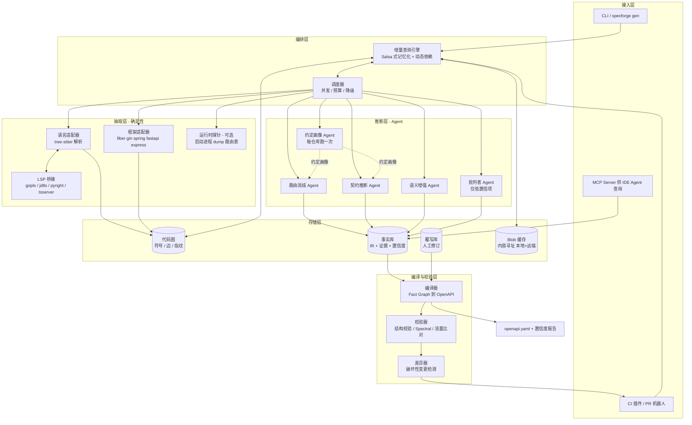
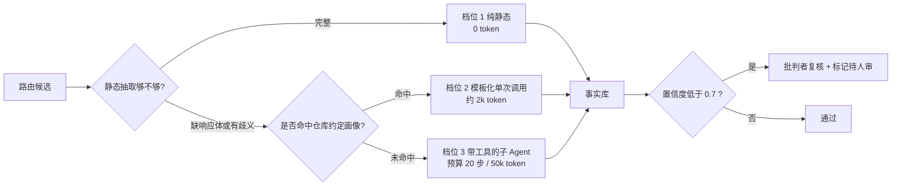
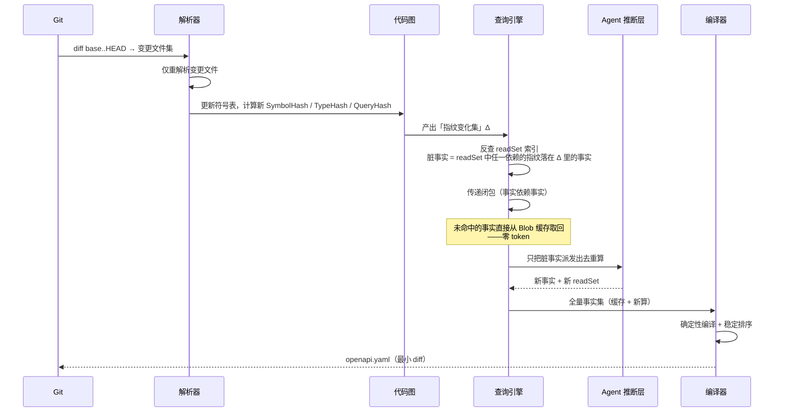
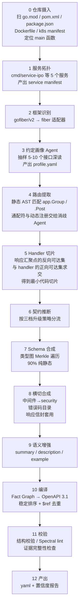
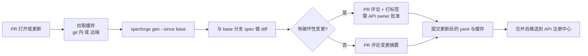

# Agent 原生的 OpenAPI 生成系统（代号：SpecForge）设计方案

> 目标：不依赖注解/注释，从任意代码仓库的任意服务中提取真实 HTTP 契约，产出 OpenAPI 3.1；
> 并以「构建系统」的方式做增量分析，使得改一行代码只重算受影响的那几个事实。

---

## 一、需求梳理

### 1.1 现状与痛点

主流 OpenAPI 生成方式全部是**代码内嵌式**：

| 技术栈 | 方式 | 对开发者的要求 |
|---|---|---|
| Go | swaggo 注释、kratos proto | 手写 `// @Param` 注释块 |
| Java | springdoc / swagger-annotations | 手写 `@Operation`、`@Schema` |
| Python | FastAPI | 靠类型注解，天然较好；Flask/Django 则需 drf-spectacular 配置 |
| Node | NestJS decorators / tsoa | 手写 `@ApiProperty` |

它们的共同前提是：**开发者愿意并持续地写这些元信息**。实际生产中三件事必然发生：

1. 大量存量服务一行注解都没有，补注解的改动量等同于重写接口层。
2. 写了注解的项目，注解与代码随时间漂移，文档比没有更危险。
3. 注解只能描述「handler 函数签名看得见的东西」。真实响应体往往在 service 层深处才被写出，注解表达不了。

**本仓库就是典型样本。** `internal/ipoServer/router.go` 里：

```go
ipoServers := app.Group("/ipo/v*")          // 通配符路径，不是合法 OpenAPI path
ipoServers.Post("/OrderCheck",
    auth.GetUserRelation(), ipoIntercepter, auth.PermissionCheck("0xff"),
    ipoController.OrderCheck)                // 三层中间件 = 三组隐式鉴权/请求头约束
```

而 handler 本身几乎不含契约信息：

```go
func (u *IpoController) OrderCheck(c *fiber.Ctx) error {
    r := new(mapping.OrderCheckReqParams)    // 请求体：要跳到 mapping 包才知道
    if err := c.BodyParser(r); err != nil {
        return code.WriteResponse(c, code.NewDefaultError(code.ErrInvalidBody), nil)
    }
    if err := r.Validate(); err != nil {      // 校验规则：在 Validate() 里
        return code.WriteResponse(c, err, nil)
    }
    return u.srv.OrderCheck(c, &r.Params)     // 响应体：在 service 层深处才写出
}
```

结论：**响应契约不在 handler 里，在调用图里。** 任何只看函数签名的方案都做不出这个仓库的文档。

### 1.2 目标

**主目标**：给定 `(仓库, 服务名)`，产出一份准确、可读、可用于 mock/SDK/网关的 OpenAPI 3.1 YAML，全程零注解要求。

**同等重要的目标**：让第 2 次及以后的运行**几乎免费**。改 3 个文件的 PR，应该只触发个位数的模型调用、30 秒内完成、成本 < ¥1。

### 1.3 功能需求

| 编号 | 需求 | 说明 |
|---|---|---|
| F1 | 服务拓扑发现 | 单仓多服务时定位入口、路由注册点、编译边界 |
| F2 | 框架识别 | 依赖 + import 模式 → 选择对应适配器 |
| F3 | 路由提取 | method / path 模板 / 路径参数 / 中间件链；能处理循环注册、通配符、表驱动路由 |
| F4 | 请求契约推断 | path / query / header / cookie 参数、body schema、content-type、校验约束 |
| F5 | 响应契约推断 | 沿调用图找到所有响应写出点，还原状态码 × body schema 矩阵，含错误分支 |
| F6 | Schema 合成 | 类型 → JSON Schema，含嵌套、泛型、枚举、可空、联合类型、`omitempty` |
| F7 | 横切关注点 | 中间件 → securitySchemes；统一响应信封；分页约定；版本前缀 |
| F8 | 语义增强 | summary / description / example / tag —— 这是 LLM 的独占价值区 |
| F9 | 增量更新 | 基于 git diff 只重算受影响事实 |
| F10 | 人工覆写留存 | 人改过的描述/示例在重新生成后不被冲掉 |
| F11 | 置信度与证据 | 每个字段可溯源到 `file:line`；低置信项单独列出待审 |
| F12 | 破坏性变更检测 | 与基线 spec 对比，在 PR 上评论 |

### 1.4 非功能需求

- **确定性**：同样的代码 + 同样的引擎版本 → 逐字节相同的 YAML。文档不能因为模型抖动而产生噪声 diff。
- **成本可控**：有 token 预算上限，超预算降级而非失败。
- **可审计**：任何一个推断都能回答「你凭什么这么写」。
- **可插拔**：新增一门语言/框架 = 实现一个适配器接口，不动内核。
- **CI 友好**：能在 PR 流水线里跑完。

### 1.5 非目标（明确不做）

- 不做代码改写（不往用户代码里插注解）。
- 不追求 100% 准确率。目标是「比手写文档更准、且永不过期」，剩余部分靠置信度标记交给人。
- 不做 GraphQL / gRPC 一等公民支持（v1 只做 HTTP/JSON；gRPC 有 proto 作为真源，本来就不需要这套）。

### 1.6 验收标准

| 维度 | 指标 |
|---|---|
| 路由召回率 | ≥ 98%（漏一个接口比写错一个字段严重得多） |
| 请求字段 F1 | ≥ 95% |
| 响应字段 F1 | ≥ 90% |
| 状态码召回 | ≥ 85% |
| 幻觉率 | < 1%（无代码证据的字段数 / 总字段数） |
| 增量缓存命中率 | 典型 PR ≥ 95% |
| 增量耗时 | P90 < 60s |

---

## 二、核心设计思想

四个判断决定了整个架构，其余都是推论。

### 思想 1：这不是「让 LLM 读代码写 YAML」，这是一条编译流水线，LLM 只是其中一个 pass

把 LLM 当唯一手段，会同时踩中成本高、不确定、不可增量三个坑。正确的分工是：

- **静态分析能算准的，绝不问模型**：类型结构、字段名、JSON tag、validator tag、路由字面量。这部分精确、免费、天然可缓存。
- **静态分析算不准的，才交给模型**：通配符路径展开、跨层响应追踪、`map[string]any` 的实际形状、中间件语义、错误码集合。
- **静态分析永远算不出的，只能给模型**：这个接口是干什么的、字段的业务含义、合理的示例值。

### 思想 2：LLM 不产出 YAML，产出「API 事实」

让模型直接吐 YAML 会带来三个问题：输出不稳定、无法局部更新、无法校验。

改成：模型产出**小颗粒、强类型、可组合的事实（Fact）**，落进一个中间表示（API Fact Graph）；再由一个**确定性编译器**把事实图编译成 OpenAPI。

好处是连锁的：
- 缓存粒度 = 事实粒度，而不是整篇文档
- 输出排序、`$ref` 命名、schema 去重全部由编译器保证 → diff 干净
- 同一份 IR 可以编译出 OpenAPI 3.0 / 3.1 / TypeSpec / MCP tool 定义 / SDK
- IR 可以做 schema 校验和 lint，能挡住一部分幻觉

### 思想 3：增量的正确解法是「带动态依赖的记忆化查询引擎」，不是「diff 文件」

这是整个系统的技术核心，也是最容易做错的地方。

朴素做法「文件变了就重算这个文件相关的一切」太粗：改一行日志会让整个文件的所有接口重算。

正确做法是照搬 rust-analyzer 的 **Salsa** 模型 / Bazel 的动态依赖模型：

> 每一次计算（包括每一次 LLM 调用）都是一个 **query**。执行时**记录它实际读取了什么**（read set）。
> 某个 query 的结果失效，当且仅当它 read set 里任何一项的指纹发生了变化。

而 **Agent 原生**这件事在这里产生了一个漂亮的性质：

> **Agent 的工具调用轨迹，天然就是依赖记录。**

Agent 为了推断 `POST /OrderCheck` 的响应，调用了 `read_symbol(OrderCheckReqParams)`、`callees(IpoController.OrderCheck)`、`read_symbol(ipoSrv.OrderCheck)`…… 这些调用连同各自返回值的哈希，就是这条事实的精确 read set。下次只要这些东西哈希不变，直接复用缓存，一个 token 都不花。不需要猜「哪些改动会影响哪些接口」——运行时已经告诉你了。

### 思想 4：无证据，不成事实

每条事实必须携带 `evidence: [{file, line_range, blob_sha}]`。编译期强制校验：**证据引用不到真实代码位置的事实，直接丢弃并降级为「未知」**。

这一条规则用很低的成本挡掉了绝大多数幻觉。宁可少一个字段并标注「未识别」，也不能凭空造一个字段——后者会让整份文档失去信任。

---

## 三、系统架构

### 3.1 总体架构图



### 3.2 分层职责

| 层 | 职责 | 关键约束 |
|---|---|---|
| 接入层 | 触发与消费 | CLI 双模式：人类友好（进度/颜色）与 Agent 友好（`--json` 结构化输出） |
| 编排层 | 决定「哪些事实需要重算」 | 唯一持有增量逻辑的地方，语言无关 |
| 抽取层 | 把代码变成符号图 + 类型图 | 纯确定性，不含任何 LLM |
| 推断层 | 补齐静态分析的缺口 | 每次调用都是可缓存的纯函数 |
| 存储层 | 内容寻址的事实与缓存 | 可提交到 git，也可推远端共享 |
| 编译层 | 事实图 → 稳定 YAML | 确定性排序，保证 diff 最小 |

### 3.3 三档升级策略（成本控制的关键）

不是所有接口都值得上 Agent。按难度分三档，让 80% 的接口走最便宜的路径：



**约定画像（Convention Profile）是最大的成本杠杆。** 对每个仓库先跑一次探索型 Agent，产出一份可缓存的「这个仓库怎么写接口」的画像：

```yaml
# .specforge/profile.yaml  —— 针对本仓库自动学习的结果
framework: gofiber/v2
response_sinks:
  - symbol: trade/pkg/code.WriteResponse
    signature: "(c *fiber.Ctx, err error, data any) error"
    envelope: { code: "$.err.Code", msg: "$.err.Msg", data: "$.data" }
response_envelope:
  type: object
  properties: { code: integer, msg: string, data: "<T>" }
  data_slot: data                       # 真正的业务 schema 挂在 data 下
request_binding:
  - pattern: "c.BodyParser(&T{})"  ->  requestBody: application/json = T
validation:
  - "T.Validate()"  ->  解析 validator tag 得到 required/min/max/oneOf
auth_middleware:
  auth.GetUserRelation:  { header: X-User-Token, scheme: apiKey, required: true }
  auth.PermissionCheck:  { header: X-User-Token, scope_arg: 0 }
  subaccount.NewSubAccountIntercepter: { header: X-Sub-Account-Id }
path_conventions:
  wildcard_expansion: { "/ipo/v*": ["/ipo/v1", "/ipo/v2"] }   # 依据配置与调用方实证
error_codes_source: trade/pkg/code   # 错误码常量集中地，一次扫描全量入库
```

画像学一次，之后 200 个接口全部套模板走档位 2。这把首次全量的成本压下一个数量级。

---

## 四、数据模型：API Fact Graph

### 4.1 事实类型

```typescript
type FactKind =
  | 'service'        // 服务元信息：名称、base path、server URL
  | 'profile'        // 仓库约定画像
  | 'route'          // 一条路由：method + path + handler 符号 + 中间件链
  | 'contract'       // 一个 operation 的参数/请求体/响应矩阵
  | 'schema'         // 一个类型的 JSON Schema
  | 'security'       // 中间件 → securityScheme
  | 'errorcatalog'   // 错误码全集
  | 'enrichment'     // summary / description / examples / tags

interface Fact<T> {
  id:          string        // 稳定逻辑 ID，见 4.3
  kind:        FactKind
  value:       T             // 强类型 IR 载荷
  source:      'static' | 'llm' | 'runtime' | 'human'
  confidence:  number        // 0..1，static=1.0
  evidence:    Evidence[]    // 无证据的事实会被编译器丢弃
  readSet:     DepRef[]      // 增量失效的依据
  engine:      EngineVersion // analyzer + prompt + model 版本
  createdAt:   string
}

interface Evidence { file: string; startLine: number; endLine: number; blobSha: string }

// 依赖可以是「内容」也可以是「派生查询」——后者是正确性的关键，见 5.3
type DepRef =
  | { kind: 'symbol';  id: string; hash: string }
  | { kind: 'type';    id: string; hash: string }   // Merkle 类型哈希
  | { kind: 'query';   name: 'callees'|'implementors'|'refs'|'members'; arg: string; hash: string }
  | { kind: 'fact';    id: string; hash: string }
  | { kind: 'file';    path: string; hash: string }
```

### 4.2 contract 事实示例（对应本仓库的 `POST /ipo/v1/OrderCheck`）

```yaml
id: contract:svc=service-ipo:op=POST_/ipo/v1/OrderCheck
kind: contract
source: llm
confidence: 0.88
value:
  operationId: ipoOrderCheck
  parameters:
    - { in: header, name: X-User-Token, required: true, schema: {type: string},
        origin: middleware:auth.GetUserRelation }
    - { in: header, name: X-Sub-Account-Id, required: false, schema: {type: string},
        origin: middleware:subaccount.NewSubAccountIntercepter }
  requestBody:
    contentType: application/json
    schemaRef: schema:trade/internal/ipoServer/mapping.OrderCheckReqParams
  responses:
    - status: 200
      envelope: { code: 0 }
      schemaRef: schema:trade/internal/ipoServer/mapping.OrderCheckResp
      sink: trade/pkg/service/ipoServer.(*ipoService).OrderCheck:L142
    - status: 200
      envelope: { code: 40001, msg: "invalid body" }
      schemaRef: null
      sink: trade/internal/ipoServer/controller/ipoServer.OrderCheck:L77
    - status: 200
      envelope: { code: "$ref:errorcatalog#/ipo/OrderCheck" }
      sink: trade/pkg/service/ipoServer.(*ipoService).OrderCheck:L98,L115,L160
evidence:
  - { file: internal/ipoServer/controller/ipoServer/ipoServer.go, startLine: 74, endLine: 83, blobSha: ab12… }
  - { file: internal/ipoServer/router.go, startLine: 66, endLine: 66, blobSha: cd34… }
readSet:
  - { kind: symbol, id: "controller.IpoController.OrderCheck", hash: "h1…" }
  - { kind: query,  name: callees, arg: "controller.IpoController.OrderCheck", hash: "h2…" }
  - { kind: symbol, id: "service.ipoService.OrderCheck", hash: "h3…" }
  - { kind: type,   id: "mapping.OrderCheckReqParams", hash: "h4…" }
  - { kind: fact,   id: "profile:repo", hash: "h5…" }
```

注意 `status: 200` 出现三次——这个仓库用的是 HTTP 200 + 业务错误码信封。这类约定静态分析看不出来，但约定画像学一次之后，全仓库通用。

### 4.3 稳定 ID 与覆写留存

覆写要活过重构，ID 就不能绑在易变的东西上。采用**多键身份解析**：

```
主键：  op:{method}:{normalized_path}
副键：  handler 符号全限定名
兜底：  请求/响应 schema 结构相似度 ≥ 0.9
```

每次运行做一次身份匹配：某个 operation 消失、同时出现一个新 operation，若副键或兜底键命中 → 写入**别名表**，把人工覆写和已生成的描述沿别名迁移过去。路径从 `/ipo/v1/OrderCheck` 改成 `/ipo/v3/OrderCheck` 时，人工写的描述不会丢。

---

## 五、增量机制（系统的技术核心）

### 5.1 指纹体系

```
FileHash(f)      = sha256(文件字节)

SymbolHash(s)    = sha256(canonical_ast(s))
                   canonical_ast 会剥离：格式/空白、非文档注释、局部变量名（alpha 重命名）
                   会保留：字段名、类型名、tag、字面量、控制流结构
                   ⇒ 改注释、改缩进、重命名局部变量 = 哈希不变 = 零成本

TypeHash(T)      = sha256(SymbolHash(T) ‖ sorted[TypeHash(D) for D in T 引用的类型])
                   ⇒ 类型图上的 Merkle DAG，改叶子类型只失效其祖先

QueryHash(q)     = sha256(q 的结构化结果)
                   例：callees(f) 的哈希 = 排序后的被调用者 ID 列表的哈希

FactKey          = sha256(kind ‖ id ‖ EngineVersion ‖ 所有 DepRef 的 hash)
```

`canonical_ast` 的剥离规则是收益最大的一处设计。实测在真实 PR 中，相当比例的改动是格式化、日志、局部变量重命名，这些应当完全不触发重算。

### 5.2 失效传播流程



`readSet` 建立反向索引（`dep_hash -> fact_ids`），失效判定是一次索引查询，与仓库规模无关。

### 5.3 一个必须处理的正确性陷阱

**只记录「读到的内容」是不够的，还必须记录「派生查询的结果」。**

举例：某次推断中 Agent 调用 `callees(ipoService.OrderCheck)` 得到 3 个被调函数，据此确定了响应矩阵。后来有人给 `OrderCheck` 加了一个新的分支，调用了新函数 `writeRiskWarning`，里面写出了一个新的响应码。

- 若 readSet 只记了那 3 个函数的内容哈希 → 它们没变 → **事实被错误地判定为有效** → 新响应码漏掉。
- 若 readSet 记录了 `{kind: query, name: callees, arg: OrderCheck}` 及其结果哈希 → 被调用者列表从 3 个变 4 个 → 哈希变化 → 正确失效。

因此：**任何"集合型"查询（callees、implementors、refs、members、routes_in_file）都必须作为一等依赖项被记录。** 这是 Salsa 类系统的经典坑，也是自研增量方案最常翻车的地方。

再加两道安全网：

1. **周期性全量重建**：每周 / 每次发版跑一次 `--no-cache`，与增量结果做 diff。出现差异即说明依赖记录有漏，告警并修正规则。
2. **保守降级开关**：`--paranoid` 模式下，把变更文件所在包内的全部事实标脏。用于关键发布前。

### 5.4 引擎版本升级（换模型/改 prompt 时不要全量重算）

把失效原因分成两类：`stale-by-code` 与 `stale-by-engine`。

引擎版本变化时不要无脑清空缓存，走**采样迁移**：

1. 随机抽 5% 的 `stale-by-engine` 事实，用新引擎重算。
2. 与旧结果做语义比对（schema 结构等价 + 描述相似度）。
3. 一致率 ≥ 95% → 其余事实标记为 `carried-forward`，仅更新版本号，不重算。
4. 一致率 < 95% → 触发该 kind 的全量重算。

这让「升级模型」从一次数百美元的全量重跑，变成一次几美元的抽检。

### 5.5 各类变更的成本对照

| 变更 | 脏事实 | LLM 调用 |
|---|---|---|
| 改注释 / 格式化 / 重命名局部变量 | 0 | **0** |
| 改文档注释 | 1 个 enrichment | 1（或直接采用注释文本，0） |
| 响应结构体加一个字段 | 1 schema + 1 字段级 enrichment | 1–2 |
| handler 加一个错误分支 | 1 contract | 1 |
| 新增一条路由 | 1 route + 1 contract + n schema | 2–4 |
| 重命名一个类型 | 结构哈希不变，仅 `$ref` 改名 | **0**（编译器改名即可） |
| 改一个被 50 个接口共用的基础类型 | 1 schema + 50 个 contract 的 ref 校验 | 1–3（contract 只需校验引用，不重推） |
| 升级框架大版本 | 全部 route 事实 | 采样迁移 |

第 6 行值得展开：**结构哈希（structural hash）与命名解耦**。`TypeHash` 分成 `shapeHash`（字段名+类型，不含类型自身名字）和 `nameHash`。重命名类型只改 `nameHash`，schema 内容完全复用，编译器换个 `$ref` 名字即可，零模型调用。

### 5.6 缓存存储与共享

```
.specforge/
  config.yaml                 # 服务定义、适配器、预算、约定覆盖
  profile.yaml                # 自动学习的仓库约定画像（可人工修订）
  overrides/
    service-ipo.yaml          # 人工覆写，按稳定 ID 索引
  cache/                      # 建议提交到 git（文本化、可 review）
    graph.db                  # SQLite：符号、边、指纹
    facts.db                  # SQLite：事实、readSet 反向索引
    blobs/                    # 内容寻址的大对象
  out/
    service-ipo.openapi.yaml
    service-ipo.report.md     # 置信度报告 + 待人审清单
```

- **提交缓存到 git**：CI 天然增量，开发者本地也命中，且缓存变更在 PR 里可见（「这次改动导致 3 条契约重算」本身就是有用的 review 信息）。
- **远端缓存（可选）**：S3/OSS 按内容哈希存取，多人多分支共享。key 是纯内容哈希，天然无冲突。

---

## 六、工作流程

### 6.1 首次全量运行



**步骤 5 的代码切片值得单独说明**，它直接决定了 token 成本和准确率。

朴素做法是把 handler 所在文件整个塞进 prompt——对本仓库那个 2751 行的 `cutover_equity_compat.go` 来说完全不可行。

正确做法是**程序切片（program slicing）**：

```
ShapeClosure(handler) =
    从 handler 出发的正向调用可达集
  ∩ 能够到达「响应汇聚点」的反向可达集
  ∪ 上述函数中引用到的全部类型的传递闭包
  受限于 深度 ≤ D 且 节点数 ≤ N
```

「响应汇聚点」由约定画像给出（本仓库是 `code.WriteResponse`）。对 `OrderCheck` 来说，切片结果大约是：handler 15 行 + `ipoService.OrderCheck` 的若干关键分支 + 两个 mapping 结构体定义，合计几百行，而不是几千行。**切片质量 = 成本 × 准确率**，是工程上最值得投入打磨的一环。

### 6.2 增量运行（PR 场景）

```
$ specforge gen --service service-ipo --since origin/main

  变更文件            4
  重解析符号          37
  指纹变化            9   （28 个符号改动被 canonical_ast 归一化吸收）
  脏事实              6   （2 schema / 3 contract / 1 enrichment）
  缓存命中          612/618  (99.0%)
  LLM 调用            6   (输入 41k tok / 输出 3.2k tok)
  耗时               22.4s   成本 ≈ ¥0.4

  OpenAPI 变更：
    + POST /ipo/v3/OrderPreview                      新增
    ~ POST /ipo/v1/OrderCreate  responses.200.data   +2 字段
    ! POST /ipo/v1/OrderCancel  request.orderId      可选 → 必填   ⚠ 破坏性

  待人工确认 1 项（置信度 0.62）：见 out/service-ipo.report.md
```

### 6.3 CI 集成



---

## 七、技术方案

### 7.1 技术选型

| 组件 | 选型 | 理由 |
|---|---|---|
| 内核语言 | Rust 或 Go | 需要分发为单文件 CLI；tree-sitter 绑定成熟。Go 与现有工具链更契合，Rust 在增量引擎上有 salsa 现成可用 |
| 语法解析 | tree-sitter | 多语言统一、增量解析、容错解析（代码编译不过也能分析） |
| 类型解析 | LSP 按需桥接（gopls / jdtls / pyright / tsserver） | tree-sitter 只有语法没有语义；跨包类型解析必须靠 LSP。按需调用，不常驻 |
| 图存储 | SQLite（可选 DuckDB 做分析查询） | 单文件、可提交、零运维 |
| 向量检索 | 可选，本地 sqlite-vec | 仅用于约定画像阶段的相似接口检索，非必需 |
| 结构化输出 | JSON Schema 约束解码 + temperature 0 | 确定性的前提 |
| 校验 | `openapi-spec-validator` + Spectral | 生态成熟，别自己写 |
| 模型分层 | 大模型跑约定画像与困难档位；小模型跑模板化档位与增强 | 成本优化 |

**关于 tree-sitter + LSP 的混合**：tree-sitter 负责快速拿到结构和做指纹（毫秒级，全仓库扫描），LSP 负责精确的跨文件类型解析（慢，按需）。两者结果都进代码图并带指纹。这个组合在准确率和速度上都优于单用其一。

### 7.2 语言/框架适配器接口

新增一门语言只需实现这个接口，内核零改动：

```go
type LanguageAdapter interface {
    // 服务与框架发现
    DetectServices(repo Repo) ([]ServiceManifest, error)
    DetectFramework(svc ServiceManifest) (FrameworkID, Confidence)

    // 指纹归一化 —— 增量能力的基石，必须实现好
    CanonicalizeSymbol(node ASTNode) ([]byte, error)   // 剥离注释/格式/局部变量名
    ShapeHash(t TypeRef) (Hash, error)                 // 结构哈希，与类型名解耦

    // 静态抽取
    ExtractRoutes(svc ServiceManifest) ([]RouteCandidate, []Unresolved, error)
    ResolveType(sym SymbolID) (TypeIR, error)
    ExtractValidation(t TypeRef) ([]Constraint, error) // validator tag / 注解 / 显式校验

    // 切片
    ResponseSinks(profile Profile) []SymbolPattern
    SliceForRoute(r RouteCandidate, budget SliceBudget) (CodeSlice, DepSet, error)
}

type FrameworkAdapter interface {
    RoutePatterns()      []ASTPattern   // app.Post("/x", h) / @GetMapping / router.get(...)
    BindingPatterns()    []ASTPattern   // c.BodyParser(&T) / @RequestBody / request.json
    SinkPatterns()       []ASTPattern   // c.JSON(...) / return ResponseEntity
    MiddlewareSemantics()[]MWRule
    RuntimeProbe()       RuntimeProbe   // 可选
}
```

v1 覆盖：Go（fiber / gin / echo / chi / net-http）、Java（Spring MVC / WebFlux）、Python（FastAPI / Flask / Django）、Node（Express / Nest / Koa）。

### 7.3 运行时探针（可选但强烈建议）

静态分析对**动态注册路由**（循环注册、配置驱动、注解扫描）天然无能为力。如果服务能在沙箱里起来，用运行时探针拿到**绝对准确**的路由表：

| 栈 | 探针方式 |
|---|---|
| Go fiber | `app.GetRoutes()` 反射 dump |
| Go gin | `engine.Routes()` |
| Spring Boot | actuator `/mappings` 端点 |
| Django | `django.urls.get_resolver().url_patterns` 遍历 |
| FastAPI | `app.openapi()` 直接就有 |
| Express | `app._router.stack` 遍历 |

探针只解决「有哪些路由」，不解决「请求/响应长什么样」。但它把 F3 的召回率从 ~90% 拉到 100%，并且能**校验静态抽取的结果**——两者不一致的地方就是高风险区，优先送去 Agent 深查。本仓库的 `app.Group("/ipo/v*")` 通配符用探针一下就能拿到真实展开结果。

### 7.4 推断 Agent 的工具集

契约推断子 Agent（档位 3）拿到的工具，全部经过依赖记录包装：

```
read_symbol(id)            → 符号源码；记录 {symbol, hash}
read_type(id)              → 类型定义（含字段 tag）；记录 {type, shapeHash}
callees(id) / callers(id)  → 调用关系；记录 {query:callees, hash}
find_refs(id)              → 引用点；记录 {query:refs, hash}
search_code(pattern)       → 文本搜索；记录 {query:search, hash}
read_tests(symbol)         → 相关测试用例（测试里常有真实请求/响应样例，是极好的证据源）
read_profile()             → 仓库约定画像
```

`read_tests` 值得特别强调：**测试代码是被严重低估的契约来源**。单元测试和集成测试里往往有完整的请求 JSON 和断言过的响应字段，比读业务逻辑推断可靠得多，而且天然提供了高质量的 `example` 值。

Agent 有硬预算（步数、token），超预算则产出「部分事实 + 低置信度 + 未解决项清单」，不允许无限探索。

### 7.5 编译器的确定性保证

```
1. 事实按 (kind, id) 全序排序
2. operation 按 (path, method) 排序；path 按分段字典序
3. schema 去重：shapeHash 相同的类型合并为一个 $ref
4. $ref 命名：优先用源类型名；冲突时加包名前缀；仍冲突加 shapeHash 前 6 位
5. 人工覆写在最后 merge，深度覆盖，优先级最高
6. YAML 序列化：固定 key 顺序（OpenAPI 规范推荐顺序）、固定缩进、不折行
```

目标是：**代码不变 → 输出逐字节相同**。这样 `git diff` 里出现的每一行都真实对应一次契约变化，文档才敢进 CI 做 gate。

### 7.6 置信度模型

```
confidence = w1·证据强度 + w2·抽取路径 + w3·交叉验证 + w4·批判者评分

证据强度：  显式类型定义 1.0 > 测试用例断言 0.9 > 控制流推断 0.7 > 命名推测 0.3
抽取路径：  静态 1.0 > 运行时探针 1.0 > 模板化 LLM 0.85 > 自由 Agent 0.7
交叉验证：  静态与探针一致 +0.1；与流量样本一致 +0.15；与测试一致 +0.1
批判者：    仅对 < 0.7 的项触发，二次模型独立复核
```

报告里只列 `< 0.8` 的项给人审。人审结果写入 `overrides/`，并且**反哺约定画像**——同一类问题第二次出现时就能自动处理了。

---

## 八、质量保障

### 8.1 评测基准（Benchmark）

这是整个项目能否持续演进的地基，必须先做。

**构造方法**：挑选 15–30 个**已有高质量注解**的开源仓库（swaggo 标注的 Go 项目、FastAPI 项目、springdoc 项目），把它们自带生成的 OpenAPI 作为 **ground truth**；然后**机械剥除所有注解/类型提示**，喂给 SpecForge，对比输出。

**评分指标**：

| 指标 | 定义 |
|---|---|
| Route Recall / Precision | 路由集合的召回与精确 |
| Param F1 | 按 (in, name, required, type) 四元组匹配 |
| Schema Field F1 | 按 (路径, 类型, 必填) 匹配，嵌套展平后比较 |
| Status Code Recall | 状态码集合召回 |
| Hallucination Rate | ground truth 中不存在且无代码证据的字段占比 |
| Incremental Hit Rate | 回放该仓库真实 commit 历史，统计缓存命中率 |
| Cost per PR | 回放 commit 历史的平均 token 成本 |

**增量评测尤其重要**：拿仓库最近 200 个 commit 逐个回放，画出「缓存命中率 / 成本」曲线。这条曲线才是产品的核心竞争力所在，必须能被量化和持续监控。

### 8.2 运行时流量校验（进阶）

在测试环境挂一个旁路代理，采集真实请求/响应样本（或直接消费 OpenTelemetry 的 HTTP span），与生成的 spec 做双向比对：

- spec 里有、流量里从未出现的字段 → 疑似幻觉或废弃字段，降置信度
- 流量里有、spec 里没有的字段 → 漏抽，触发重推
- 类型不符 → 高优先级告警

这同时提供了**高质量的真实 example**（脱敏后）。这是让准确率从 90% 迈向 98% 的手段。

### 8.3 防幻觉的硬约束清单

1. 无 evidence 的字段一律丢弃，标记为 `x-specforge-unknown`。
2. evidence 的 `blobSha` 必须能在当前提交中校验通过，否则事实作废。
3. schema 字段名必须能在源码中精确匹配到（字段名或 json tag），否则丢弃。
4. 状态码必须能追溯到具体的响应写出语句。
5. `description` 允许自由生成（这本来就是主观的），但 `description` 不得引入结构性信息。

---

## 九、落地路线图

| 阶段 | 周期 | 交付 | 验证目标 |
|---|---|---|---|
| **P0 可行性** | 2–3 周 | 只支持 Go + fiber，只跑本仓库 `service-ipo`；无缓存，全量生成 | 能不能在一个真实的无注解仓库上做出 ≥90% 路由召回。**先证明可行，再谈增量** |
| **P1 IR 与编译器** | 2 周 | Fact Graph + 确定性编译器 + 证据校验 + 置信度报告 | 输出稳定、diff 干净、幻觉可控 |
| **P2 增量引擎** | 3–4 周 | 代码图 + 指纹体系 + readSet + 失效传播 + 缓存 | 回放本仓库 100 个 commit，命中率 ≥ 95% |
| **P3 约定画像与分档** | 2 周 | profile 自动学习 + 三档升级 + 预算控制 | 首次全量成本下降 5–10 倍 |
| **P4 多语言** | 4 周 | Java Spring + Python FastAPI/Flask + Node Express | 适配器接口是否真的够抽象 |
| **P5 产品化** | 3 周 | CI 插件 + PR 破坏性变更检测 + 覆写 UI + MCP Server | 团队愿不愿意长期开着 |
| **P6 运行时增强** | 并行 | 运行时探针 + 流量校验 | 准确率 90% → 98% |

**关键节点**：P0 结束时做一次严肃的 go/no-go 评审。如果在本仓库这种复杂度上路由召回做不到 90%，说明切片和约定学习的思路需要重来，此时推倒成本最低。

---

## 十、风险与取舍

| 风险 | 影响 | 对策 |
|---|---|---|
| 动态路由静态抽不出 | 漏接口，且用户不知道漏了 | 运行时探针兜底；探针与静态结果做差集并**显式报告未覆盖项** |
| 生成代码（protoc-gen / openapi-generator 产物） | 分析二手产物，浪费且不准 | 识别生成标记，回溯到真源（`.proto` / 已有 spec）直接转换 |
| `interface{}` / `any` / `json.RawMessage` | 无法定型 | 结合调用点实证 + 测试样例 + 流量样本；实在不行标 `additionalProperties: true` 并降置信度 |
| 全局中间件改写响应 | 所有接口的响应结构都错 | 约定画像专门识别 response-mutating 中间件；探针 + 流量校验交叉确认 |
| 依赖记录漏项导致增量结果不正确 | **最危险**：静默产出过期文档 | 集合型查询必须记为依赖（5.3）；周期性全量重建对账；`--paranoid` 模式 |
| 模型升级导致文档大面积无意义变更 | diff 噪声，团队失去信任 | 采样迁移（5.4）；描述类事实一旦生成即冻结，除非代码变化 |
| 首次全量成本过高吓退用户 | 无法落地 | 约定画像 + 三档分流；支持 `--budget` 上限与分批增量铺开（先跑 20 个高频接口） |
| 与已有手写文档冲突 | 团队抵触 | 提供 `import` 模式：把现有 spec 作为 human 来源的事实导入，只补充不覆盖 |

### 一个需要明确取舍的地方

**准确率 vs 成本，不应该由系统猜，应该交给用户按接口分级。**

配置里允许声明接口重要度：

```yaml
tiers:
  critical:            # 强制走档位 3 + 批判者 + 流量校验
    - "POST /ipo/*/Order*"
  normal:              # 默认三档分流
    - "*"
  skip:                # 完全不分析
    - "/Time"
    - "**/Ping"
```

核心交易接口值得花 10 倍成本做到 98%，健康检查接口一个 token 都不该花。

---

## 附：与现有方案的差异总结

| | 注解式（swaggo 等） | 朴素 LLM（喂仓库给大模型） | SpecForge |
|---|---|---|---|
| 存量改造成本 | 极高（要改所有代码） | 零 | 零 |
| 跨层响应追踪 | 做不到 | 受上下文窗口限制，不可靠 | 程序切片 + 调用图，可靠 |
| 增量成本 | 零（编译期） | 每次全量，极高 | 接近零 |
| 输出稳定性 | 完全确定 | 每次都不一样 | 确定（事实冻结 + 确定性编译） |
| 可审计性 | 代码即文档 | 无 | 每字段可溯源到 file:line |
| 语义描述质量 | 取决于开发者（通常很差） | 好 | 好，且一次生成长期复用 |
| 漂移风险 | 高（注解会过期） | 无 | 无 |

**一句话概括这个系统**：把 LLM 从「文档生成器」降格为「编译流水线里的一个可缓存 pass」，用构建系统的严谨性来约束模型的不确定性，从而同时拿到 Agent 的理解力和编译器的确定性与增量能力。
